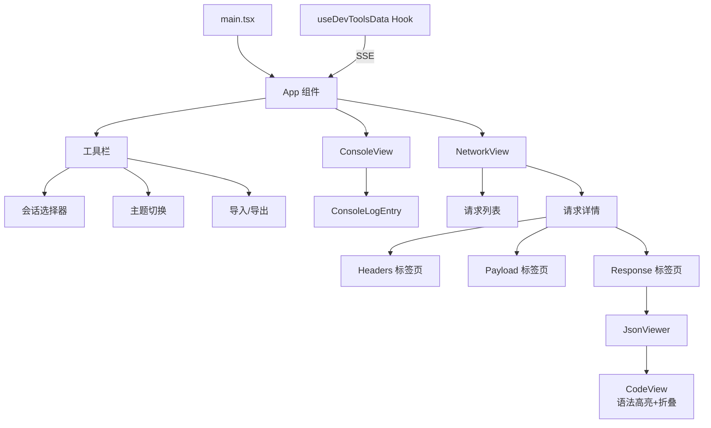

# devtools/client 架构

> DevTools 前端客户端，基于 React 实现控制台和网络日志的可视化查看界面。

## 概述

`client` 目录包含 DevTools 的 React 前端应用。应用通过 SSE（Server-Sent Events）连接服务端的 `/events` 端点，实时接收网络请求和控制台日志数据。界面分为 Console 和 Network 两个面板，支持多会话切换、日志过滤、域名分组、JSON 语法高亮（含代码折叠）、明暗主题切换，以及会话日志的 JSONL 格式导入/导出。构建使用 esbuild 打包为单个 JS 文件后内嵌到服务端。

## 架构图

## 关键文件

| 文件 | 功能 |
|------|------|
| `src/main.tsx` | React 应用入口，使用 ReactDOM.createRoot 渲染 App 组件 |
| `src/App.tsx` | 主应用组件：实现完整的 DevTools UI。核心组件包括 `ConsoleView`（控制台日志列表，支持长内容折叠）、`NetworkView`（网络请求列表，支持 URL 过滤和域名分组）、`NetworkDetail`（请求详情，Headers/Payload/Response 三标签页）、`JsonViewer`（JSON 语法高亮，支持 SSE chunk 解析）、`CodeView`（带行号和折叠的 JSON 查看器）。支持 light/dark/system 三种主题模式 |
| `src/hooks.ts` | `useDevToolsData()` Hook：通过 EventSource 连接 `/events` SSE 端点，处理 snapshot（完整快照）、network（增量网络日志）、console（增量控制台日志）、session（会话列表更新）四种事件类型。维护 networkLogs、consoleLogs、connectedSessions 状态 |

## 内部依赖

- `hooks.ts` 依赖 `../../src/types.ts`（NetworkLog、InspectorConsoleLog 类型）

## 外部依赖

| 包名 | 用途 |
|------|------|
| `react` | UI 组件框架 |
| `react-dom` | DOM 渲染 |
