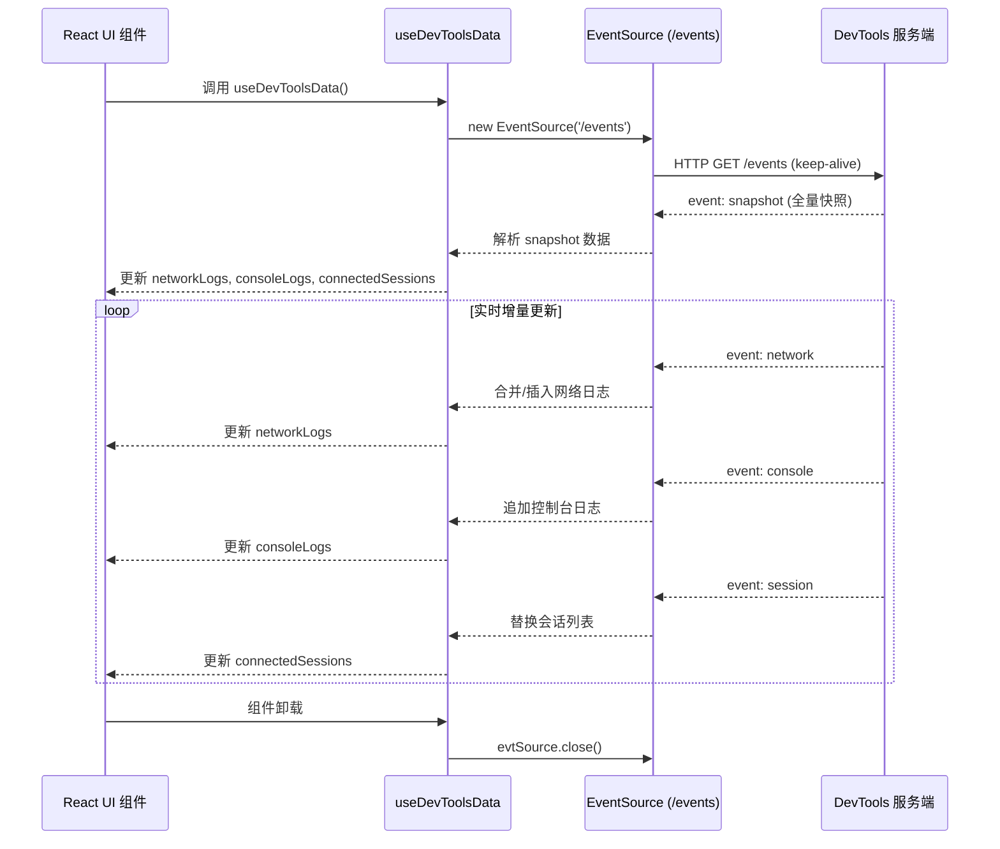

# hooks.ts

> DevTools 前端 React Hook -- 通过 SSE 实时订阅服务端日志数据并维护客户端状态。

## 概述

`hooks.ts` 是 devtools 前端客户端的数据层核心，提供了唯一的自定义 Hook `useDevToolsData`。该 Hook 封装了与 DevTools 服务端的 SSE（Server-Sent Events）通信，将网络日志、控制台日志和会话连接状态作为 React 状态暴露给 UI 组件。

设计动机：将数据获取逻辑从 UI 组件中解耦，使组件只需调用一个 Hook 即可获得全部实时数据，符合 React Hooks 的组合式设计哲学。

在模块中的角色：本文件是前端客户端与服务端之间的桥梁。服务端 `index.ts` 的 `/events` SSE 端点产出数据，本 Hook 消费这些数据并转化为 React 响应式状态。

## 架构图



## 主要导出

### 类型重新导出

```typescript
export type { NetworkLog };
export type { InspectorConsoleLog as ConsoleLog } from '../../src/types.js';
```

重新导出两个类型供客户端其他模块使用。注意 `InspectorConsoleLog` 被重命名为 `ConsoleLog`，提供更简洁的客户端命名。

### `function useDevToolsData()`

```typescript
export function useDevToolsData(): {
  networkLogs: NetworkLog[];
  consoleLogs: ConsoleLog[];
  isConnected: boolean;
  connectedSessions: string[];
}
```

React 自定义 Hook，返回一个包含四个字段的对象：

| 字段 | 类型 | 说明 |
|------|------|------|
| `networkLogs` | `NetworkLog[]` | 当前所有网络请求日志 |
| `consoleLogs` | `ConsoleLog[]` | 当前所有控制台日志 |
| `isConnected` | `boolean` | SSE 连接是否已建立 |
| `connectedSessions` | `string[]` | 当前活跃的 CLI 会话 ID 列表 |

## 核心逻辑

### 1. SSE 连接管理

Hook 在组件挂载时（`useEffect` 空依赖数组 `[]`）创建 `EventSource` 对象连接到 `/events` 端点。

- `onopen` 回调将 `isConnected` 设为 `true`
- `onerror` 回调将 `isConnected` 设为 `false`（浏览器 EventSource 会自动重连）
- 组件卸载时在 cleanup 函数中调用 `evtSource.close()` 关闭连接

### 2. snapshot 事件处理 -- 全量快照合并

收到 `snapshot` 事件时，不是简单替换本地数据，而是执行**智能合并**策略：

**网络日志合并：**
```
已有日志 Map(id => log) + 服务端日志 => 去重合并后的数组
```
使用 `Map` 按 `id` 去重，服务端数据会覆盖本地同 `id` 的旧条目。这确保了在服务端重启后，客户端已缓存的日志不会丢失，同时又能接收到服务端的最新状态。

**控制台日志合并：**
```
已有日志 + 服务端新增日志（按 id 过滤去重）=> 合并数组（上限 5000）
```
使用 `Set` 按 `id` 过滤已存在的日志，只追加真正的新条目。合并后总量超过 5000 条时截取最近的 5000 条。

### 3. network 事件处理 -- 增量更新

收到单条网络日志更新时：
- 在现有数组中按 `id` 查找
- 若找到，就地替换（创建新数组副本以触发 React 重渲染）
- 若未找到，追加到数组末尾

### 4. console 事件处理 -- 追加与裁剪

收到单条控制台日志时：
- 直接追加到数组末尾
- 若总量超过 5000 条，使用 `slice(-5000)` 保留最近的 5000 条

此上限与服务端 `index.ts` 中的 5000 条限制保持一致。

### 5. session 事件处理

收到会话列表更新时，直接替换 `connectedSessions` 状态。这是因为服务端发送的是完整的会话列表，无需增量合并。

### 6. 错误处理策略

所有事件监听器中的 JSON 解析操作均使用 `try/catch` 包裹，捕获后静默忽略。这是一种防御性编程策略：即使收到格式错误的 SSE 数据，也不会导致整个 UI 崩溃，连接依然保持，后续正常数据仍可正常处理。

## 内部依赖

| 模块 | 说明 |
|------|------|
| `../../src/types.js` | 提供 `NetworkLog` 和 `InspectorConsoleLog` 类型定义，确保客户端与服务端使用相同的数据结构 |

## 外部依赖

| npm 包 | 用途 |
|--------|------|
| `react` | 提供 `useState` 和 `useEffect` Hook，用于管理组件状态和副作用 |

此外隐式依赖浏览器内置的 `EventSource` API（SSE 客户端）。
