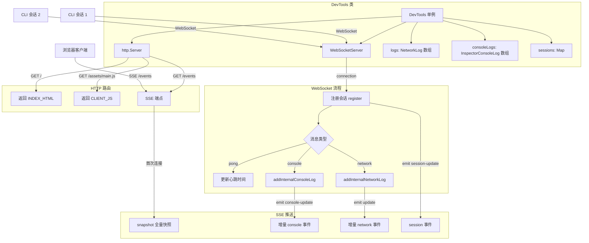

# index.ts

> DevTools 服务端核心模块 -- 通过 HTTP + WebSocket 接收 CLI 会话日志并以 SSE 推送给浏览器前端。

## 概述

`index.ts` 是 `@anthropic/devtools` 包的入口文件，实现了 **DevTools** 类。该类是一个单例（Singleton）模式的事件发射器（`EventEmitter`），承担以下职责：

1. **启动 HTTP 服务器** -- 托管前端静态资源（HTML / JS），并提供 SSE（Server-Sent Events）端点 `/events` 向浏览器实时推送日志。
2. **启动 WebSocket 服务器** -- 监听来自 CLI 会话的连接，处理会话注册、心跳保活、网络日志与控制台日志上报。
3. **日志存储与管理** -- 在内存中维护网络请求日志（最多 2000 条）和控制台日志（最多 5000 条），支持增量更新与流式 chunk 累积。
4. **会话管理** -- 维护当前活跃的 CLI 会话列表，通过心跳机制自动清理超时（30 秒）的连接。

设计动机：为 Gemini CLI 提供类似浏览器 DevTools 的网络/控制台检查能力，开发者可在浏览器中实时观察 CLI 与 API 之间的通信。

## 架构图



## 主要导出

### 类型重新导出

```typescript
export type { NetworkLog, ConsoleLogPayload, InspectorConsoleLog } from './types.js';
```

从 `types.ts` 重新导出三个核心类型接口，供外部消费者使用而无需直接依赖 `types.ts`。

### `interface SessionInfo`

```typescript
export interface SessionInfo {
  sessionId: string;
  ws: WebSocket;
  lastPing: number;
}
```

描述一个已注册的 CLI 会话信息：
- `sessionId` -- 会话唯一标识
- `ws` -- 该会话对应的 WebSocket 连接对象
- `lastPing` -- 最后一次心跳时间戳（毫秒），用于超时判断

### `class DevTools extends EventEmitter`

核心类，采用单例模式。以下逐一说明公开方法：

#### `static getInstance(): DevTools`

获取 DevTools 单例实例。若实例不存在则创建。

#### `start(): Promise<string>`

启动 HTTP 服务器与 WebSocket 服务器。返回服务器访问 URL（如 `http://127.0.0.1:25417`）。

- 若服务器已在运行，直接返回现有 URL。
- 默认端口 `25417`，若被占用则自动递增尝试，最多重试 10 次。
- 启动成功后自动调用 `setupWebSocketServer()` 初始化 WebSocket。

#### `stop(): Promise<void>`

优雅关闭所有资源：清除心跳定时器、关闭 WebSocket 服务器、关闭 HTTP 服务器，并重置单例实例以便后续可重新 `start()`。

#### `getUrl(): string`

返回当前服务器的完整 URL，格式为 `http://127.0.0.1:{port}`。

#### `getPort(): number`

返回当前服务器实际监听的端口号。

#### `addInternalConsoleLog(payload, sessionId?, timestamp?)`

```typescript
addInternalConsoleLog(
  payload: ConsoleLogPayload,
  sessionId?: string,
  timestamp?: number,
): void
```

添加一条控制台日志。自动分配 UUID 和时间戳，推入 `consoleLogs` 数组（上限 5000 条，超出时移除最早的），并触发 `console-update` 事件。

#### `addInternalNetworkLog(payload, sessionId?, timestamp?)`

```typescript
addInternalNetworkLog(
  payload: IncomingNetworkPayload,
  sessionId?: string,
  timestamp?: number,
): void
```

添加或更新一条网络日志，逻辑较为复杂（详见"核心逻辑"节）。

## 核心逻辑

### 1. 网络日志的增量更新与 Chunk 累积

`addInternalNetworkLog` 是最复杂的方法，处理三种场景：

**场景 A -- 已有日志 + 收到 chunk：**
当 payload 包含 `chunk` 字段时，将 chunk 追加到已有日志的 `chunks` 数组中。这用于流式响应（streaming response）场景，服务端逐块接收响应数据。

**场景 B -- 已有日志 + 常规更新：**
将 payload 合并到已有日志上。特别注意：当 `payload.response?.body` 存在（即完整响应体已到达）时，会将 `chunks` 置为 `undefined`，因为此时 chunks 数据已冗余，保留两者会在 JSON 序列化时可能突破 V8 字符串限制。

**场景 C -- 新日志：**
当日志 `id` 不存在于当前列表中且有 `url` 字段时，创建新条目。日志总量上限 2000 条，超出时移除最早的。

### 2. HTTP 服务器的同源保护

HTTP 服务器在处理请求时检查 `Origin` 头。只有来源为 `http://127.0.0.1:{port}`（即服务器自身）的请求才会设置 CORS 允许头。这可防止任意网站通过跨域请求窃取可能包含 API 密钥的日志数据。

### 3. SSE 端点的生命周期

`/events` 端点的处理流程：

1. **连接建立时** -- 发送 `snapshot` 事件，包含当前所有网络日志、控制台日志和活跃会话列表的完整快照。
2. **持续期间** -- 监听 `update`、`console-update`、`session-update` 三个事件，分别以 `network`、`console`、`session` SSE 事件名推送增量数据。
3. **连接关闭时** -- 清理所有事件监听器，防止内存泄漏。

### 4. WebSocket 会话管理

**注册流程：**
CLI 连接后发送 `{ type: 'register', sessionId: '...' }` 消息。服务端将其存入 `sessions` Map，发送 `registered` 确认，并通知所有 SSE 客户端。

**心跳机制：**
每 10 秒向所有会话发送 `ping` 消息。会话回复 `pong` 时更新 `lastPing` 时间戳。若超过 30 秒未收到 `pong`，则主动关闭连接并移除会话。定时器使用 `.unref()` 确保不会阻止 Node.js 进程退出。

**消息路由：**
注册后的会话发送的消息通过 `handleWebSocketMessage` 分发：
- `pong` -- 更新心跳
- `console` -- 调用 `addInternalConsoleLog`
- `network` -- 调用 `addInternalNetworkLog`

### 5. 端口自动递增

默认端口 `25417`。当 `EADDRINUSE` 错误发生时，端口号递增 1 并重试监听。最多从默认端口起递增 10 次（即尝试 25417~25427），全部失败则 reject 错误。

## 内部依赖

| 模块 | 说明 |
|------|------|
| `./types.js` | 提供 `NetworkLog`、`ConsoleLogPayload`、`InspectorConsoleLog` 类型定义 |
| `./_client-assets.js` | 提供构建后的前端静态资源常量 `INDEX_HTML` 和 `CLIENT_JS` |

## 外部依赖

| npm 包 | 用途 |
|--------|------|
| `ws` | 提供 `WebSocketServer` 和 `WebSocket` 类型，用于 WebSocket 服务端通信 |

此外使用了以下 Node.js 内置模块：

| 模块 | 用途 |
|------|------|
| `node:http` | 创建 HTTP 服务器 |
| `node:crypto` | `randomUUID()` 生成日志条目的唯一 ID |
| `node:events` | `EventEmitter` 基类，用于事件驱动的日志推送 |
