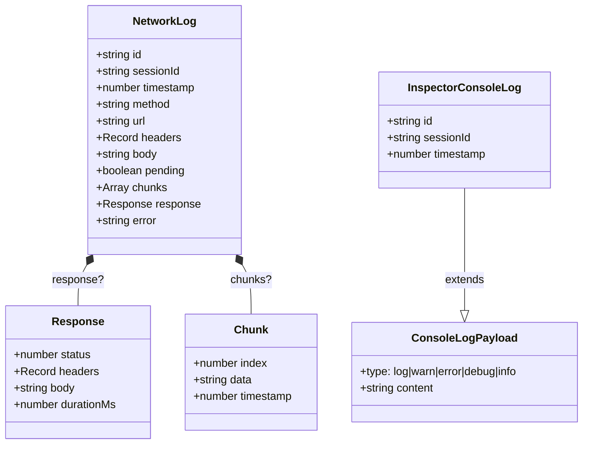

# types.ts

> DevTools 包的核心类型定义文件 -- 定义网络日志与控制台日志的数据结构。

## 概述

`types.ts` 是 `@anthropic/devtools` 包的类型声明文件，定义了在服务端（`index.ts`）和客户端（`hooks.ts`）之间共享的数据接口。该文件不包含任何运行时代码，仅导出 TypeScript 接口（interface），作为整个 devtools 模块的"数据契约层"。

设计动机：将类型定义集中在一个独立文件中，确保服务端写入的日志结构与客户端消费的日志结构保持一致，避免两端接口不同步的问题。

## 架构图



## 主要导出

### `interface NetworkLog`

```typescript
export interface NetworkLog {
  id: string;
  sessionId?: string;
  timestamp: number;
  method: string;
  url: string;
  headers: Record<string, string | string[] | undefined>;
  body?: string;
  pending?: boolean;
  chunks?: Array<{ index: number; data: string; timestamp: number }>;
  response?: {
    status: number;
    headers: Record<string, string | string[] | undefined>;
    body?: string;
    durationMs: number;
  };
  error?: string;
}
```

描述一条完整的 HTTP 网络请求日志。字段说明：

| 字段 | 类型 | 必填 | 说明 |
|------|------|------|------|
| `id` | `string` | 是 | 请求唯一标识符，用于增量更新时匹配已有日志 |
| `sessionId` | `string` | 否 | 产生该请求的 CLI 会话 ID |
| `timestamp` | `number` | 是 | 请求发起的 Unix 时间戳（毫秒） |
| `method` | `string` | 是 | HTTP 方法，如 `GET`、`POST` |
| `url` | `string` | 是 | 请求 URL |
| `headers` | `Record` | 是 | 请求头。值可为字符串、字符串数组或 undefined |
| `body` | `string` | 否 | 请求体内容 |
| `pending` | `boolean` | 否 | 是否仍在等待响应 |
| `chunks` | `Array` | 否 | 流式响应的分块数据。每个 chunk 包含序号 `index`、数据 `data` 和时间戳 `timestamp` |
| `response` | `object` | 否 | 响应信息，包含状态码 `status`、响应头 `headers`、响应体 `body` 和耗时 `durationMs`（毫秒） |
| `error` | `string` | 否 | 请求发生错误时的错误描述 |

设计要点：
- `chunks` 与 `response.body` 在逻辑上互斥。当完整响应体 `body` 到达后，服务端会清除 `chunks` 以避免冗余数据导致序列化时超出 V8 字符串限制。
- `headers` 类型使用 `Record<string, string | string[] | undefined>` 是为了兼容 Node.js `http.IncomingHttpHeaders` 的格式，某些头部（如 `Set-Cookie`）会以字符串数组形式出现。

### `interface ConsoleLogPayload`

```typescript
export interface ConsoleLogPayload {
  type: 'log' | 'warn' | 'error' | 'debug' | 'info';
  content: string;
}
```

描述一条控制台日志的载荷（不含元数据）：

| 字段 | 类型 | 说明 |
|------|------|------|
| `type` | `'log' \| 'warn' \| 'error' \| 'debug' \| 'info'` | 日志级别，对应 `console` API 的五种方法 |
| `content` | `string` | 日志内容文本 |

### `interface InspectorConsoleLog extends ConsoleLogPayload`

```typescript
export interface InspectorConsoleLog extends ConsoleLogPayload {
  id: string;
  sessionId?: string;
  timestamp: number;
}
```

继承 `ConsoleLogPayload`，增加了元数据字段，构成一条完整的控制台日志记录：

| 字段 | 类型 | 必填 | 说明 |
|------|------|------|------|
| `id` | `string` | 是 | 日志唯一标识符（由服务端通过 `randomUUID()` 生成） |
| `sessionId` | `string` | 否 | 产生该日志的 CLI 会话 ID |
| `timestamp` | `number` | 是 | 日志产生的 Unix 时间戳（毫秒） |

设计模式：将载荷（Payload）与完整记录分离为两个接口，是因为 CLI 端上报时只需提供 `type` 和 `content`，而 `id`、`sessionId`、`timestamp` 等元数据由 DevTools 服务端自动填充。

## 核心逻辑

本文件不包含运行时逻辑，仅提供类型定义。其"核心逻辑"体现在类型设计上：

1. **继承模式**：`InspectorConsoleLog extends ConsoleLogPayload`，将"网络传输载荷"与"存储完整记录"分层，清晰划分了客户端上报的数据边界和服务端补充的元数据。

2. **内联类型 vs 独立接口**：`NetworkLog.response` 和 `NetworkLog.chunks` 中的元素类型使用了内联定义而非独立接口，说明这些子结构只在 `NetworkLog` 上下文中使用，不需要独立复用。

3. **可选字段设计**：大部分字段标记为可选（`?`），反映了网络日志的渐进式构建特性 -- 一条日志最初只有请求信息（`method`、`url`、`headers`），响应到达后才补充 `response`，出错时才填充 `error`。

## 内部依赖

无。本文件是 devtools 包的类型基础层，不依赖包内其他模块。

## 外部依赖

无。本文件仅使用 TypeScript 内置类型（`string`、`number`、`boolean`、`Record`、`Array`），无任何外部 npm 包依赖。
