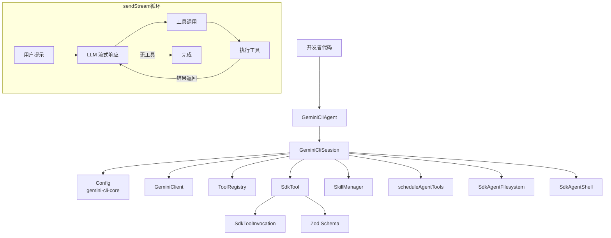

# sdk 架构

> Gemini CLI 的编程 SDK，允许开发者以 TypeScript API 方式创建自定义 Agent、注册工具、加载技能并与 Gemini 模型交互。

## 概述

`sdk` 包是 Gemini CLI 的编程接口封装，提供了 `GeminiCliAgent` 和 `GeminiCliSession` 两个核心类，使开发者无需通过命令行即可在 Node.js 程序中使用 Gemini CLI 的完整功能。SDK 支持自定义工具注册（基于 Zod schema）、技能加载、会话管理（含恢复）、流式消息处理和动态系统指令。它在 `@google/gemini-cli-core` 之上提供了更高层次的抽象。

## 架构图



## 目录结构

```
packages/sdk/
├── index.ts              # 包入口
├── package.json          # 依赖 gemini-cli-core、zod
├── src/
│   ├── index.ts          # 源码入口，导出所有模块
│   ├── agent.ts          # GeminiCliAgent 类
│   ├── session.ts        # GeminiCliSession 类
│   ├── tool.ts           # Tool 定义和 SdkTool 类
│   ├── skills.ts         # 技能引用类型
│   ├── types.ts          # 类型定义
│   ├── fs.ts             # 文件系统抽象
│   └── shell.ts          # Shell 执行抽象
├── examples/             # 示例代码
├── SDK_DESIGN.md         # 设计文档
├── tsconfig.json
└── vitest.config.ts
```

## 关键文件

| 文件 | 功能 |
|------|------|
| `index.ts` | 包入口，重新导出 src |
| `package.json` | 依赖 gemini-cli-core、zod、zod-to-json-schema |

## 内部依赖

- `src/agent.ts` - Agent 工厂
- `src/session.ts` - 会话管理
- `src/tool.ts` - 工具系统
- `src/skills.ts` - 技能引用
- `src/types.ts` - 类型定义
- `src/fs.ts` - 文件系统抽象
- `src/shell.ts` - Shell 抽象

## 外部依赖

| 包名 | 用途 |
|------|------|
| `@google/gemini-cli-core` | Config、GeminiClient、Scheduler、工具基类等核心功能 |
| `zod` | 工具参数 schema 定义 |
| `zod-to-json-schema` | 将 Zod schema 转换为 JSON Schema |
