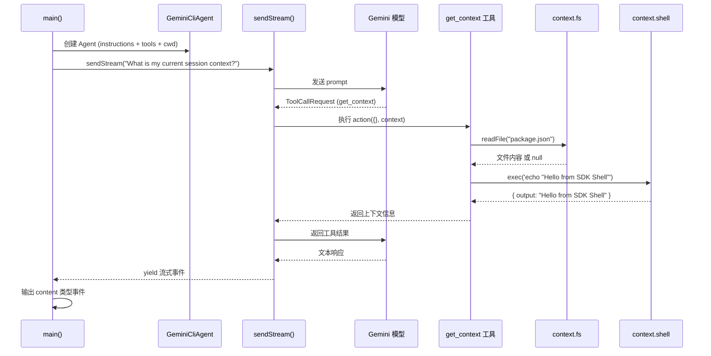

# examples/session-context.ts

> 进阶示例——演示如何在工具的 `action` 中访问 `SessionContext`，使用文件系统和 Shell 能力。

## 概述

此文件是 SDK 的进阶示例，展示了如何通过工具的第二个参数 `context: SessionContext` 访问会话上下文中的各项能力：

1. **会话信息**：`context.sessionId`、`context.cwd`、`context.timestamp`
2. **文件系统访问**：`context.fs.readFile()` 读取项目文件
3. **Shell 命令执行**：`context.shell.exec()` 运行系统命令

此示例帮助开发者理解 `SessionContext` 的完整能力，以及如何构建能够感知运行环境的智能工具。

## 架构图



## 主要导出

无导出（此文件是独立的可执行脚本）。

## 核心逻辑

### 1. 定义 `get_context` 工具

```ts
const getContextTool = tool(
  {
    name: 'get_context',
    description: 'Get information about the current session context.',
    inputSchema: z.object({}),
  },
  async (_params, context) => { ... },
);
```

- 输入 schema 为空对象（无需参数）。
- `action` 通过第二个参数 `context` 访问 `SessionContext`。

### 2. 工具 action 内部逻辑

工具执行时依次完成以下操作：

**a) 读取会话信息**
```ts
context.sessionId  // 会话 ID
context.cwd        // 当前工作目录
context.timestamp  // 时间戳
```

**b) 文件系统访问**
```ts
const fileContent = await context.fs.readFile('package.json');
```
尝试读取工作目录下的 `package.json`，若失败则优雅降级（捕获异常并记录日志）。

**c) Shell 命令执行**
```ts
const result = await context.shell.exec('echo "Hello from SDK Shell"');
const shellOutput = result.output.trim();
```
执行简单的 echo 命令，验证 Shell 执行能力。

**d) 返回聚合结果**
```ts
return {
  sessionId: context.sessionId,
  cwd: context.cwd,
  hasFsAccess: !!context.fs,
  hasShellAccess: !!context.shell,
  packageJsonExists: !!fileContent,
  shellEcho: shellOutput,
};
```

### 3. 创建 Agent 并指定 cwd

```ts
const agent = new GeminiCliAgent({
  instructions: 'You are a helpful assistant. Use the get_context tool...',
  tools: [getContextTool],
  cwd: process.cwd(),  // 显式设置工作目录
});
```

注意：此示例显式设置了 `cwd`，确保 `package.json` 能被找到。

### 4. 流式对话与事件过滤

```ts
for await (const chunk of agent.sendStream('What is my current session context?')) {
  if (chunk.type === 'content') {
    process.stdout.write(chunk.value || '');
  }
}
```

与 `simple.ts` 不同，此示例仅输出 `content` 类型的事件（即模型的文本响应），过滤掉工具调用等其他事件类型，展示了更精细的事件处理方式。

## 内部依赖

| 模块 | 导入项 | 说明 |
|------|--------|------|
| `../src/index.js` | `GeminiCliAgent`, `tool`, `z` | SDK 的核心导出 |

## 外部依赖

无直接外部依赖（通过 SDK 间接依赖 `zod` 和 `@google/gemini-cli-core`）。
