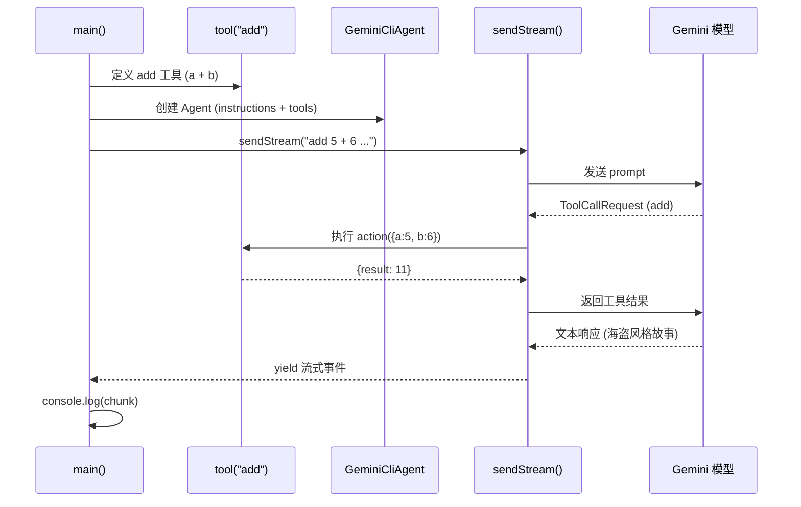

# examples/simple.ts

> 最简示例——演示如何使用 SDK 创建 Agent、定义自定义工具并进行流式对话。

## 概述

此文件是 SDK 的入门示例，展示了最基本的使用流程：
1. 使用 `tool()` 工厂函数和 Zod schema 定义一个自定义工具。
2. 使用 `GeminiCliAgent` 创建一个配置了系统指令和工具的 Agent。
3. 通过 `agent.sendStream()` 发送提示词并以流式方式接收模型响应。

此示例可作为新用户理解 SDK 核心 API 的起点。

## 架构图



## 主要导出

无导出（此文件是独立的可执行脚本）。

## 核心逻辑

### 1. 定义自定义工具 `add`

```ts
const myTool = tool(
  {
    name: 'add',
    description: 'Add two numbers.',
    inputSchema: z.object({
      a: z.number().describe('the first number'),
      b: z.number().describe('the second number'),
    }),
  },
  async ({ a, b }) => {
    return { result: a + b };
  },
);
```

- 使用 `z.object()` 定义输入参数 schema，包含两个数字字段 `a` 和 `b`。
- `action` 函数返回包含求和结果的对象。

### 2. 创建 Agent

```ts
const agent = new GeminiCliAgent({
  instructions: 'Make sure to always talk like a pirate.',
  tools: [myTool],
});
```

- 系统指令要求模型以海盗风格说话。
- 将 `add` 工具注册到 Agent。

### 3. 流式对话

```ts
for await (const chunk of agent.sendStream(
  'add 5 + 6 and tell me a story involving the result',
)) {
  console.log(JSON.stringify(chunk, null, 2));
}
```

- 通过 `for await...of` 遍历异步生成器，逐个打印流式事件。
- 模型会先调用 `add` 工具计算 5+6=11，然后用结果编写一个海盗风格的故事。

> 注意：示例中直接调用 `agent.sendStream()`，这是一个便捷方法，内部会自动创建 Session。

## 内部依赖

| 模块 | 导入项 | 说明 |
|------|--------|------|
| `../src/index.js` | `GeminiCliAgent`, `tool`, `z` | SDK 的核心导出 |

## 外部依赖

无直接外部依赖（通过 SDK 间接依赖 `zod` 和 `@google/gemini-cli-core`）。
