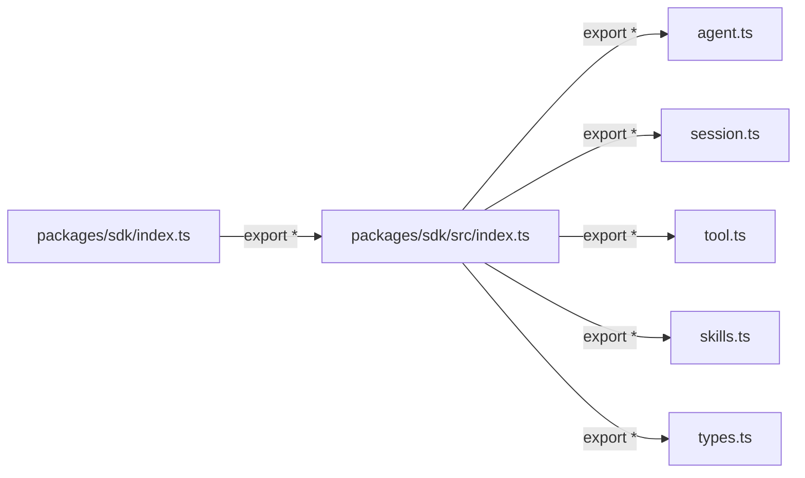

# index.ts

> SDK 包的顶层入口文件，将 `src/index.ts` 中的所有导出重新导出。

## 概述

此文件是 `@anthropic/gemini-cli-sdk`（或对应的包名）的包级入口点。它采用 **barrel export**（桶导出）模式，将 `./src/index.js` 中暴露的全部公共 API 透传到包的根路径，使消费者可以直接通过包名进行导入，而无需关心内部目录结构。

设计动机：
- 保持包根目录整洁，仅包含一行再导出语句。
- 所有真正的实现与导出集中管理在 `src/` 子目录中。

## 架构图



## 主要导出

```ts
export * from './src/index.js';
```

将 `src/index.ts` 中的所有命名导出（包括类、函数、类型、接口等）一并重新导出。具体内容参见 [src/index.md](./src/index.md)。

## 核心逻辑

无独立逻辑，仅作为转发层。

## 内部依赖

| 模块 | 说明 |
|------|------|
| `./src/index.js` | SDK 的真正导出聚合模块 |

## 外部依赖

无。
