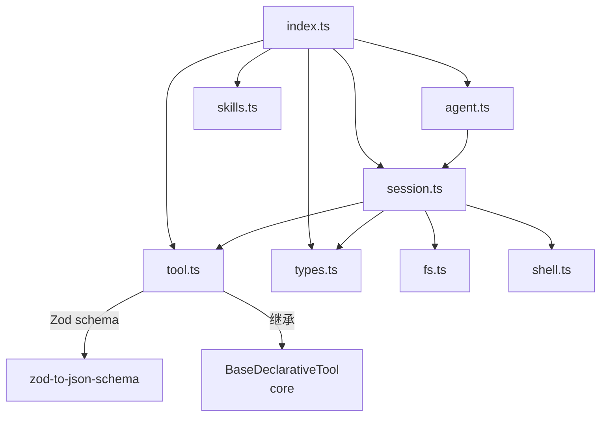

# sdk/src 架构

> SDK 源码目录，实现 Agent、Session、Tool、Skill 等核心编程接口。

## 概述

SDK 源码由 8 个模块文件组成，提供了一套完整的编程式 Gemini CLI 接口。`agent.ts` 是入口工厂，创建和恢复会话。`session.ts` 是核心运行时，管理配置初始化、LLM 通信、工具调度循环。`tool.ts` 提供基于 Zod 的类型安全工具定义机制，将用户定义的函数包装为 Gemini CLI 核心可识别的 `BaseDeclarativeTool`。`fs.ts` 和 `shell.ts` 分别提供受路径验证保护的文件系统和 Shell 执行能力。`skills.ts` 提供技能目录引用。

## 架构图

## 关键文件

| 文件 | 功能 |
|------|------|
| `agent.ts` | `GeminiCliAgent` 类：Agent 工厂，持有配置选项。`session()` 创建新会话，`resumeSession()` 从本地存储恢复历史会话 |
| `session.ts` | `GeminiCliSession` 类：核心会话运行时。`initialize()` 初始化认证、Config、工具注册和技能加载。`sendStream()` 实现完整的 Agent 循环：发送 prompt -> 收集 LLM 事件 -> 调度工具执行 -> 将结果发回 LLM -> 循环直到无更多工具调用 |
| `tool.ts` | `Tool<T>` 接口和 `SdkTool<T>` 类：用 Zod schema 定义工具参数，`tool()` 辅助函数创建工具实例。`SdkToolInvocation` 处理工具执行，支持 `ModelVisibleError` 将错误信息传给模型。`bindContext()` 方法在每次执行时绑定 SessionContext |
| `types.ts` | 核心类型定义：`GeminiCliAgentOptions`（Agent 配置）、`SessionContext`（会话上下文，含 fs/shell/transcript）、`AgentFilesystem`/`AgentShell` 接口 |
| `skills.ts` | `SkillReference` 类型和 `skillDir()` 辅助函数，用于引用技能目录 |
| `fs.ts` | `SdkAgentFilesystem` 类：实现 AgentFilesystem 接口，读写文件前通过 Config.validatePathAccess 进行路径安全验证 |
| `shell.ts` | `SdkAgentShell` 类：实现 AgentShell 接口，通过 ShellTool 检查策略、使用 ShellExecutionService 执行命令 |

## 内部依赖

- `agent.ts` 依赖 `session.ts`、`types.ts`
- `session.ts` 依赖 `tool.ts`、`fs.ts`、`shell.ts`、`types.ts`、`skills.ts`
- `tool.ts` 依赖 `types.ts`

## 外部依赖

| 包名 | 用途 |
|------|------|
| `@google/gemini-cli-core` | Config、GeminiClient、BaseDeclarativeTool、Scheduler、ShellTool、ShellExecutionService、Storage、SkillManager 等 |
| `zod` | 工具参数 schema 定义和验证 |
| `zod-to-json-schema` | Schema 转换为 JSON Schema 供 LLM 使用 |
