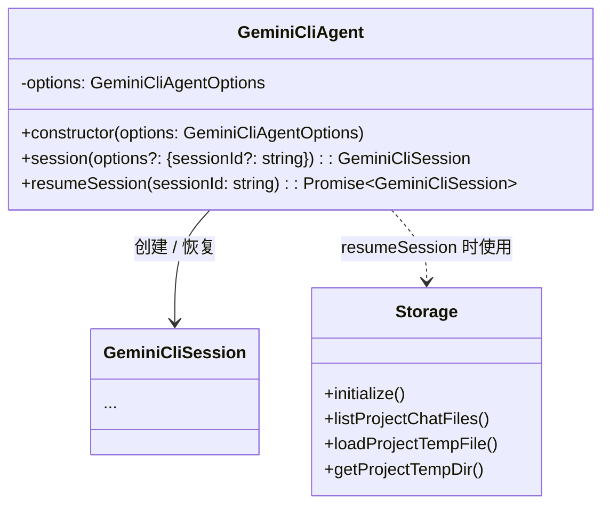

# agent.ts

> 定义 `GeminiCliAgent` 类——SDK 的顶层入口对象，负责创建和恢复会话。

## 概述

`GeminiCliAgent` 是 SDK 面向用户的主要入口类。它封装了 Agent 级别的配置（模型、工具、指令等），并提供两个核心方法：
- `session()` —— 创建一个全新的会话。
- `resumeSession()` —— 根据 sessionId 从持久化存储中恢复先前的会话。

在 SDK 的分层设计中，`GeminiCliAgent` 处于最上层，是会话（`GeminiCliSession`）的工厂。每个 Agent 实例可创建多个独立的 Session。

## 架构图

## 主要导出

### `class GeminiCliAgent`

| 成员 | 签名 | 说明 |
|------|------|------|
| 构造函数 | `constructor(options: GeminiCliAgentOptions)` | 保存配置项，不做任何异步初始化 |
| `session` | `session(options?: { sessionId?: string }): GeminiCliSession` | 创建新会话。若未提供 `sessionId`，会自动调用 `createSessionId()` 生成唯一 ID |
| `resumeSession` | `resumeSession(sessionId: string): Promise<GeminiCliSession>` | 从磁盘恢复已有会话，返回携带历史记录的 `GeminiCliSession` 实例 |

## 核心逻辑

### `session()` —— 新建会话

1. 若调用者未传入 `sessionId`，调用 `createSessionId()` 生成新 ID。
2. 用当前 Agent 的 `options`、生成的 `sessionId` 和自身引用创建并返回 `GeminiCliSession`。

### `resumeSession()` —— 恢复会话

1. 确定工作目录 `cwd`（优先使用 `options.cwd`，否则取 `process.cwd()`）。
2. 实例化 `Storage` 并调用 `initialize()` 初始化存储层。
3. 调用 `listProjectChatFiles()` 列出所有已持久化的聊天文件。
4. **优化策略**：使用 `sessionId` 的前 8 位字符作为文件名快速过滤候选文件，减少需要加载的文件数量。若快速过滤无结果，则回退到扫描全部文件。
5. 逐个加载候选文件并比对 `sessionId`，找到匹配的 `ConversationRecord`。
6. 构建 `ResumedSessionData`（包含会话记录和文件路径），创建并返回携带恢复数据的 `GeminiCliSession`。
7. 若未找到匹配会话，抛出 `Error`。

## 内部依赖

| 模块 | 导入项 | 说明 |
|------|--------|------|
| `./session.js` | `GeminiCliSession` | 会话类 |
| `./types.js` | `GeminiCliAgentOptions`（类型） | Agent 配置选项接口 |

## 外部依赖

| 包 | 导入项 | 说明 |
|----|--------|------|
| `node:path` | `path` | Node.js 路径拼接工具 |
| `@google/gemini-cli-core` | `Storage`, `createSessionId`, `ResumedSessionData`（类型）, `ConversationRecord`（类型） | 核心库的存储服务与会话 ID 生成工具 |
