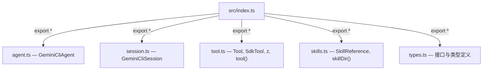

# src/index.ts

> SDK `src` 目录的聚合导出文件，汇总并暴露所有公共模块的 API。

## 概述

此文件是 SDK 内部的模块汇聚点（barrel file）。它从五个核心子模块中将所有命名导出重新导出，构成 SDK 对外公开的完整 API 表面。外部消费者通过包级 `index.ts` 最终引用的正是此文件提供的导出集合。

设计动机：
- 集中管理 SDK 对外暴露的公共 API，避免消费者直接依赖内部文件路径。
- 当新增模块时，只需在此处追加一行 `export *`。

## 架构图

## 主要导出

| 重导出来源 | 包含的关键导出 |
|-----------|--------------|
| `./agent.js` | `GeminiCliAgent` |
| `./session.js` | `GeminiCliSession` |
| `./tool.js` | `Tool`, `ToolDefinition`, `SdkTool`, `ModelVisibleError`, `z`, `tool()` |
| `./skills.js` | `SkillReference`, `skillDir()` |
| `./types.js` | `SystemInstructions`, `GeminiCliAgentOptions`, `AgentFilesystem`, `AgentShell`, `AgentShellOptions`, `AgentShellResult`, `SessionContext` |

## 核心逻辑

无独立逻辑，纯粹的再导出聚合。

## 内部依赖

| 模块 | 说明 |
|------|------|
| `./agent.js` | Agent 类定义 |
| `./session.js` | 会话管理类 |
| `./tool.js` | 工具定义与注册 |
| `./skills.js` | 技能引用辅助 |
| `./types.js` | 类型定义 |

## 外部依赖

无（间接依赖由各子模块自行声明）。
