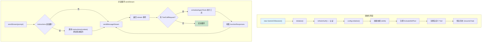
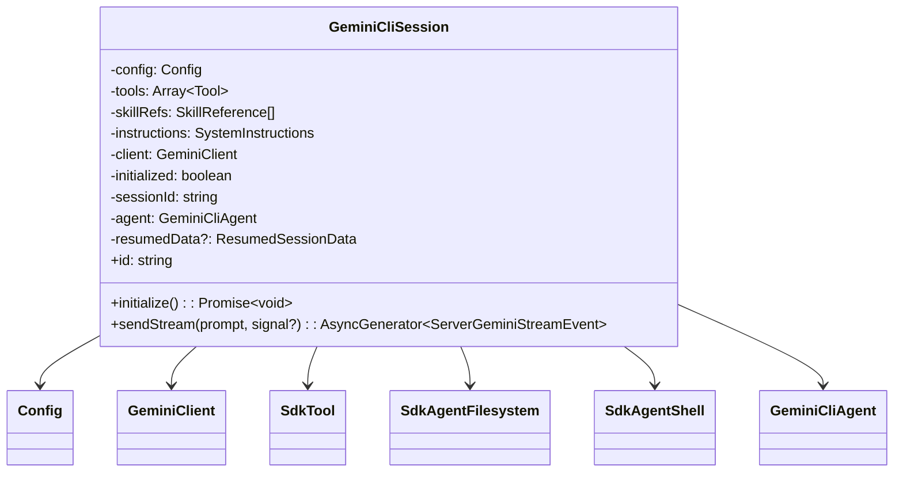

# session.ts

> 定义 `GeminiCliSession` 类——SDK 的会话管理核心，负责初始化运行时环境、注册工具与技能、以及驱动 Agent 对话循环。

## 概述

`GeminiCliSession` 是 SDK 中最重要的运行时类。每个 Session 代表一次独立的对话会话，包含：
- 与 Gemini 模型的通信客户端（`GeminiClient`）
- 已注册的自定义工具（`Tool`）和技能（`Skill`）
- 会话级配置（`Config`）

Session 通过 `GeminiCliAgent.session()` 或 `GeminiCliAgent.resumeSession()` 创建，提供 `sendStream()` 异步生成器方法进行流式对话。其核心设计特点是 **Agent Loop**（代理循环）：当模型返回工具调用请求时，Session 自动调度工具执行，并将结果反馈给模型，直到模型返回纯文本响应为止。

## 架构图

## 主要导出

### `class GeminiCliSession`

| 成员 | 签名 | 说明 |
|------|------|------|
| 构造函数 | `constructor(options, sessionId, agent, resumedData?)` | 创建 Session，初始化 Config 并保存工具/技能引用（不触发异步初始化） |
| `id` | `get id(): string` | 只读属性，返回当前会话 ID |
| `initialize` | `initialize(): Promise<void>` | 执行异步初始化：认证、Config 初始化、技能加载、工具注册、历史恢复 |
| `sendStream` | `sendStream(prompt: string, signal?: AbortSignal): AsyncGenerator<ServerGeminiStreamEvent>` | 向模型发送消息并以异步生成器方式返回流式事件，自动处理工具调用循环 |

## 核心逻辑

### 构造函数

1. 提取 `instructions` —— 若为字符串则作为 `initialMemory`；若为函数则延迟到 `sendStream` 时动态调用；其他类型抛出异常。
2. 构建 `ConfigParameters`，包括：
   - 会话 ID、工作目录、调试模式、模型名称
   - 禁用 hooks / MCP / extensions（SDK 场景下默认精简配置）
   - 启用技能支持
   - 策略引擎默认允许所有操作（`PolicyDecision.ALLOW`）
3. 实例化 `Config`。

### `initialize()` —— 异步初始化

1. **幂等保护**：若已初始化则直接返回。
2. **认证**：从环境变量获取认证类型（默认 `COMPUTE_ADC`），调用 `config.refreshAuth()`。
3. **Config 初始化**：调用 `config.initialize()`。
4. **技能加载**：
   - 遍历 `skillRefs`，对 `type === 'dir'` 的引用调用 `loadSkillsFromDir()` 从目录批量加载技能。
   - 将加载成功的技能添加到 `SkillManager`。
5. **注册 ActivateSkillTool**：若有可用技能，在工具注册表中注册（或替换）`ActivateSkillTool`。
6. **注册自定义工具**：遍历 `this.tools`，逐一包装为 `SdkTool` 并注册到 `ToolRegistry`。
7. **获取 GeminiClient** 引用。
8. **恢复历史**：若存在 `resumedData`，将历史消息转换为 `Content[]` 格式，调用 `client.resumeChat()` 恢复对话上下文。
9. 标记 `initialized = true`。

### `sendStream()` —— 流式对话与工具循环

1. **自动初始化**：若未初始化则先调用 `initialize()`。
2. **构建运行时上下文**：创建 `SdkAgentFilesystem` 和 `SdkAgentShell`。
3. **进入 while 循环**：
   - **动态指令**：若 `instructions` 是函数，构建 `SessionContext` 并调用它，用返回值更新系统指令（`setUserMemory` + `updateSystemInstruction`）。
   - **发送请求**：调用 `client.sendMessageStream(request, signal, sessionId)` 获取事件流。
   - **遍历事件**：将每个事件 `yield` 给调用者。若遇到 `ToolCallRequest` 事件，收集工具调用信息。
   - **工具调度**：若收集到工具调用请求：
     - 构建带上下文的 `scopedRegistry`（通过 `Object.create` 创建原型链代理，`getTool` 方法为 `SdkTool` 实例绑定 `SessionContext`）。
     - 调用 `scheduleAgentTools()` 并行执行所有工具。
     - 提取工具执行结果的 `responseParts` 作为下一轮请求。
   - **终止条件**：若无工具调用请求，跳出循环。

## 内部依赖

| 模块 | 导入项 | 说明 |
|------|--------|------|
| `./tool.js` | `Tool`（类型）, `SdkTool` | 工具接口与 SDK 工具包装类 |
| `./fs.js` | `SdkAgentFilesystem` | 文件系统适配层 |
| `./shell.js` | `SdkAgentShell` | Shell 命令执行适配层 |
| `./types.js` | `SessionContext`, `GeminiCliAgentOptions`, `SystemInstructions`（类型） | 类型定义 |
| `./skills.js` | `SkillReference`（类型） | 技能引用类型 |
| `./agent.js` | `GeminiCliAgent`（类型） | Agent 类型引用 |

## 外部依赖

| 包 | 导入项 | 说明 |
|----|--------|------|
| `@google/gemini-cli-core` | `AgentLoopContext`, `Config`, `ConfigParameters`, `AuthType`, `PREVIEW_GEMINI_MODEL_AUTO`, `GeminiEventType`, `ToolCallRequestInfo`, `ServerGeminiStreamEvent`, `GeminiClient`, `Content`, `scheduleAgentTools`, `getAuthTypeFromEnv`, `ToolRegistry`, `loadSkillsFromDir`, `ActivateSkillTool`, `ResumedSessionData`, `PolicyDecision` | 核心库——提供配置、认证、模型客户端、工具调度、事件类型等基础设施 |
