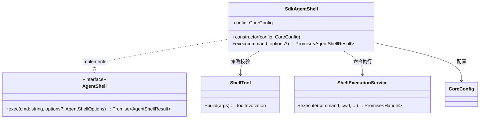
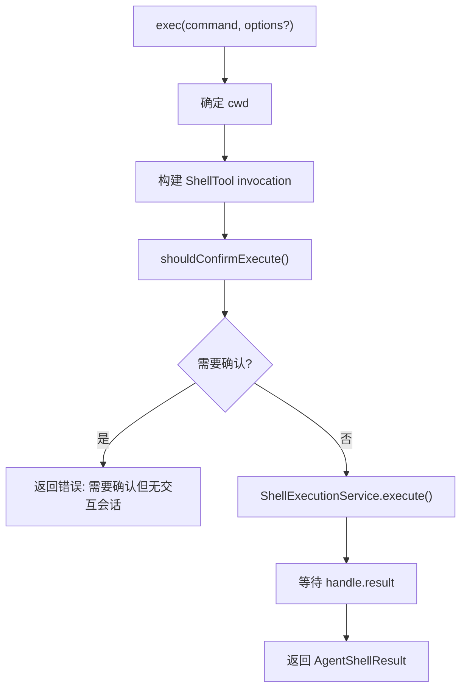

# shell.ts

> 提供受策略控制的 Shell 命令执行能力，实现 `AgentShell` 接口。

## 概述

`SdkAgentShell` 是 SDK 中供工具在执行上下文中安全运行 Shell 命令的适配层。它实现了 `AgentShell` 接口，在执行实际命令之前通过 `ShellTool` 的策略引擎检查命令是否需要用户确认。由于 SDK 运行在无交互（headless）环境中，若命令需要确认则直接拒绝执行。

设计动机：
- 复用核心库的 `ShellTool` 策略引擎进行安全校验，避免绕过安全机制。
- 复用核心库的 `ShellExecutionService` 执行命令，保持行为一致性。
- 在 SDK 的无交互环境中，任何需要用户确认的命令都会被安全地拒绝。

## 架构图

## 主要导出

### `class SdkAgentShell`

实现 `AgentShell` 接口。

| 成员 | 签名 | 说明 |
|------|------|------|
| 构造函数 | `constructor(config: CoreConfig)` | 注入核心配置对象 |
| `exec` | `exec(command: string, options?: AgentShellOptions): Promise<AgentShellResult>` | 执行 Shell 命令并返回结果 |

## 核心逻辑

### `exec(command, options?)` 执行流程

1. **确定工作目录**：优先使用 `options?.cwd`，否则使用 `config.getWorkingDir()`。
2. **创建 AbortController**：用于控制命令执行的中断信号。
3. **策略校验**：
   - 从 `Config` 获取 `AgentLoopContext`，构建 `ShellTool` 实例。
   - 调用 `shellTool.build({ command, dir_path: cwd })` 创建调用对象。
   - 调用 `invocation.shouldConfirmExecute(signal)` 检查是否需要用户确认。
   - 若需要确认（返回值为 truthy），由于 SDK 是无交互环境，直接返回 `exitCode: 1` 和错误信息。
   - 若校验过程抛出异常，同样返回错误结果。
4. **执行命令**：
   - 调用 `ShellExecutionService.execute()` 执行命令，参数包括：
     - `command`：要执行的命令
     - `cwd`：工作目录
     - 空函数作为输出事件处理器（无交互模式不需要实时输出）
     - `AbortSignal`：中断信号
     - `shouldUseNodePty: false`：无头执行不使用伪终端
     - `config.getShellExecutionConfig()`：Shell 执行配置
5. **返回结果**：等待 `handle.result`，构建并返回 `AgentShellResult`。
   - 注意：`ShellExecutionService` 将 stdout 和 stderr 合并输出，因此 `stderr` 字段为空字符串。

## 内部依赖

| 模块 | 导入项 | 说明 |
|------|--------|------|
| `./types.js` | `AgentShell`, `AgentShellResult`, `AgentShellOptions`（类型） | Shell 接口与结果类型定义 |

## 外部依赖

| 包 | 导入项 | 说明 |
|----|--------|------|
| `@google/gemini-cli-core` | `AgentLoopContext`（类型）, `ShellExecutionService`, `ShellTool`, `Config`（类型，别名 `CoreConfig`） | 核心库——提供 Shell 执行服务、Shell 工具策略引擎、Agent 循环上下文 |
