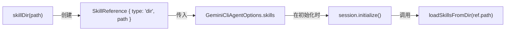

# skills.ts

> 定义技能引用类型与工厂函数，用于声明式地引用技能目录。

## 概述

此文件提供了 SDK 中技能（Skill）引用的声明方式。技能是预定义的能力包，可以从文件系统目录加载。此模块定义了 `SkillReference` 类型和 `skillDir()` 工厂函数，让用户以声明式的方式指定技能来源目录，在 `GeminiCliAgentOptions.skills` 中使用。

设计动机：
- 提供简洁的 API 让用户声明技能来源。
- 通过类型标签（`type: 'dir'`）为未来扩展其他加载方式（如远程加载、内联定义等）预留空间。
- 实际的技能加载逻辑由 `session.ts` 中的 `initialize()` 方法通过核心库的 `loadSkillsFromDir()` 完成。

## 架构图



## 主要导出

### `type SkillReference`

```ts
type SkillReference = { type: 'dir'; path: string };
```

技能引用的类型定义。当前仅支持 `type: 'dir'`（目录类型），`path` 为技能目录的文件系统路径。

### `function skillDir(path: string): SkillReference`

```ts
function skillDir(path: string): SkillReference
```

工厂函数，接收一个目录路径，返回一个 `SkillReference` 对象。

**参数：**
- `path: string` —— 技能目录的路径。

**返回值：** `{ type: 'dir', path }` 形式的 `SkillReference` 对象。

**使用示例：**
```ts
const agent = new GeminiCliAgent({
  instructions: '...',
  skills: [skillDir('/path/to/my-skills')],
});
```

## 核心逻辑

逻辑极为简单：`skillDir()` 仅将传入的路径包装为带有 `type: 'dir'` 标签的对象字面量。所有复杂的技能加载与注册逻辑都在 `session.ts` 的 `initialize()` 中处理。

## 内部依赖

无。

## 外部依赖

无。
