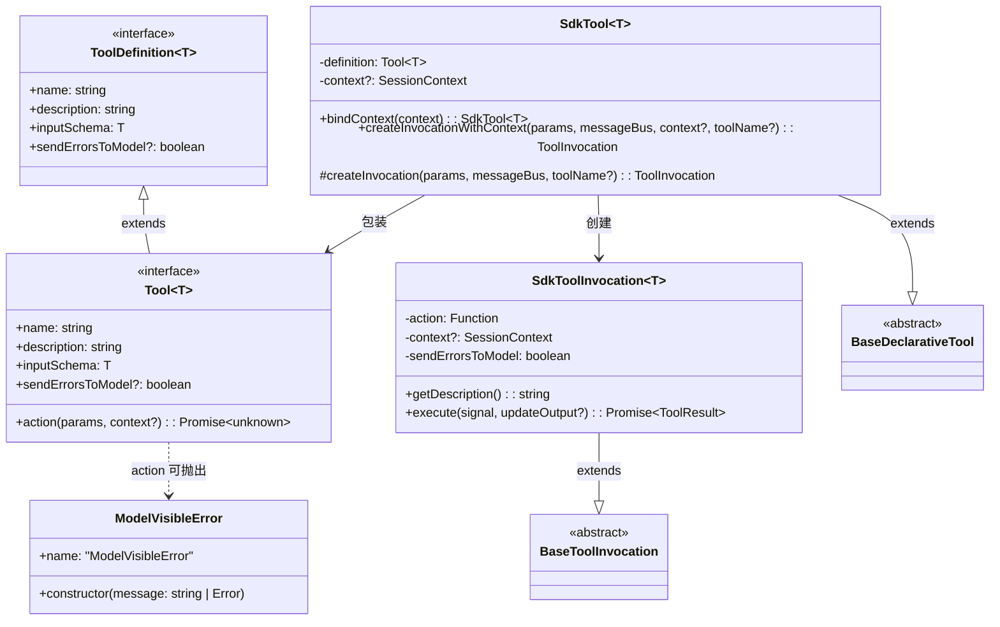
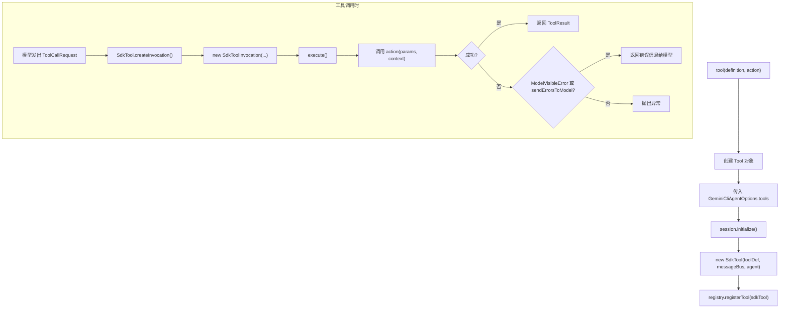

# tool.ts

> 定义 SDK 的工具体系——包括工具接口、工具包装类、工具调用执行逻辑及便捷工厂函数。

## 概述

此文件是 SDK 工具系统的核心实现，承担以下职责：

1. **定义工具接口**：`ToolDefinition<T>` 和 `Tool<T>` 描述了用户自定义工具的结构。
2. **包装为核心工具**：`SdkTool<T>` 将用户定义的 `Tool<T>` 包装为核心库能够识别和调度的 `BaseDeclarativeTool`。
3. **执行工具调用**：`SdkToolInvocation<T>` 封装了工具的实际执行逻辑，包括错误处理策略。
4. **提供工厂函数**：`tool()` 函数简化工具的创建过程。
5. **重导出 Zod**：将 `z` 重导出，供用户定义输入 schema。

设计动机：
- 用户只需关心 `tool()` 工厂函数和 Zod schema，无需了解核心库的工具注册机制。
- 通过 `zodToJsonSchema` 自动将 Zod schema 转换为 JSON Schema，供模型理解工具参数。
- `ModelVisibleError` 允许工具选择性地将错误信息暴露给模型。

## 架构图





## 主要导出

### `z` (重导出)

```ts
export { z } from 'zod';
```

Zod 验证库的重导出，供用户定义工具输入 schema 时使用。

### `class ModelVisibleError extends Error`

```ts
class ModelVisibleError extends Error {
  constructor(message: string | Error)
}
```

特殊错误类型。当工具的 `action` 抛出此类型的错误时，错误信息会被传递给模型（即使 `sendErrorsToModel` 为 `false`），让模型能够理解并处理错误。

### `interface ToolDefinition<T extends z.ZodTypeAny>`

```ts
interface ToolDefinition<T extends z.ZodTypeAny> {
  name: string;
  description: string;
  inputSchema: T;
  sendErrorsToModel?: boolean;
}
```

工具的元数据定义，不包含执行逻辑。

| 字段 | 说明 |
|------|------|
| `name` | 工具名称，模型通过此名称调用工具 |
| `description` | 工具描述，帮助模型理解何时使用此工具 |
| `inputSchema` | Zod schema，定义工具接受的参数结构 |
| `sendErrorsToModel` | 是否将所有运行时错误发送给模型（默认 `false`） |

### `interface Tool<T extends z.ZodTypeAny>`

```ts
interface Tool<T extends z.ZodTypeAny> extends ToolDefinition<T> {
  action: (params: z.infer<T>, context?: SessionContext) => Promise<unknown>;
}
```

完整的工具定义，在 `ToolDefinition` 基础上增加了 `action` 执行函数。`action` 接收经 Zod 解析后的参数和可选的会话上下文。

### `class SdkTool<T>`

继承 `BaseDeclarativeTool`，是核心库工具注册系统能识别的包装类。

| 成员 | 签名 | 说明 |
|------|------|------|
| 构造函数 | `constructor(definition, messageBus, _agent?, context?)` | 通过 `zodToJsonSchema` 将 Zod schema 转换为 JSON Schema 并注册 |
| `bindContext` | `bindContext(context: SessionContext): SdkTool<T>` | 创建新的 SdkTool 实例并绑定会话上下文（不可变模式） |
| `createInvocationWithContext` | `createInvocationWithContext(params, messageBus, context?, toolName?): ToolInvocation` | 创建带上下文的工具调用对象 |
| `createInvocation` | `protected createInvocation(params, messageBus, toolName?): ToolInvocation` | 核心库回调方法，创建工具调用对象 |

### `function tool<T>(definition, action): Tool<T>`

```ts
function tool<T extends z.ZodTypeAny>(
  definition: ToolDefinition<T>,
  action: (params: z.infer<T>, context?: SessionContext) => Promise<unknown>,
): Tool<T>
```

工厂函数，将 `ToolDefinition` 和 `action` 合并为完整的 `Tool` 对象。这是用户创建自定义工具的推荐方式。

## 核心逻辑

### `SdkToolInvocation.execute()` —— 工具执行与错误处理

1. 调用 `this.action(this.params, this.context)` 执行用户定义的工具逻辑。
2. **成功时**：将返回值序列化为字符串（若为 `string` 则直接使用，否则 `JSON.stringify`），构造 `ToolResult`。
3. **失败时**：
   - 若 `sendErrorsToModel === true` 或错误是 `ModelVisibleError` 实例，将错误信息包装为 `ToolResult` 返回给模型。
   - 否则，直接抛出异常（由上层处理）。

### `SdkTool.bindContext()` —— 不可变上下文绑定

通过创建新的 `SdkTool` 实例（而非修改现有实例）来绑定上下文，符合不可变数据模式。这在 `session.ts` 的 `scopedRegistry` 中被调用，确保每次工具调用都拥有正确的会话上下文。

## 内部依赖

| 模块 | 导入项 | 说明 |
|------|--------|------|
| `./types.js` | `SessionContext`（类型） | 会话上下文接口 |

## 外部依赖

| 包 | 导入项 | 说明 |
|----|--------|------|
| `zod` | `z` | Schema 验证库，用于定义工具输入参数 |
| `zod-to-json-schema` | `zodToJsonSchema` | 将 Zod schema 转换为 JSON Schema，供模型理解参数结构 |
| `@google/gemini-cli-core` | `BaseDeclarativeTool`, `BaseToolInvocation`, `ToolResult`（类型）, `ToolInvocation`（类型）, `Kind`, `MessageBus`（类型） | 核心库——工具基类与类型定义 |
