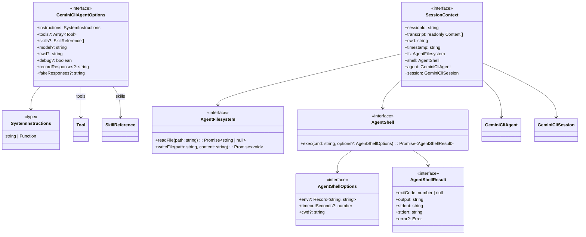

# types.ts

> SDK 的核心类型定义文件，包含所有公共接口和类型别名。

## 概述

此文件集中定义了 SDK 中所有重要的 TypeScript 类型和接口。它不包含任何运行时逻辑，仅作为类型契约的声明。这些类型被 SDK 内部的各个模块引用，同时也通过 `src/index.ts` 导出给外部消费者。

主要类型分为四组：
1. **Agent 配置类型** —— `GeminiCliAgentOptions`、`SystemInstructions`
2. **文件系统抽象** —— `AgentFilesystem`
3. **Shell 执行抽象** —— `AgentShell`、`AgentShellOptions`、`AgentShellResult`
4. **会话上下文** —— `SessionContext`

## 架构图



## 主要导出

### `type SystemInstructions`

```ts
type SystemInstructions =
  | string
  | ((context: SessionContext) => string | Promise<string>);
```

系统指令的类型。支持两种形式：
- **静态字符串**：在会话初始化时一次性设置。
- **动态函数**：每次发送消息前调用，可根据当前会话上下文动态生成指令。函数支持返回 `Promise`。

### `interface GeminiCliAgentOptions`

Agent 的配置选项，传入 `GeminiCliAgent` 构造函数。

| 字段 | 类型 | 必填 | 说明 |
|------|------|------|------|
| `instructions` | `SystemInstructions` | 是 | 系统指令（静态字符串或动态函数） |
| `tools` | `Array<Tool<any>>` | 否 | 自定义工具列表 |
| `skills` | `SkillReference[]` | 否 | 技能引用列表 |
| `model` | `string` | 否 | 模型名称（默认 `PREVIEW_GEMINI_MODEL_AUTO`） |
| `cwd` | `string` | 否 | 工作目录（默认 `process.cwd()`） |
| `debug` | `boolean` | 否 | 是否启用调试模式 |
| `recordResponses` | `string` | 否 | 记录响应的文件路径（用于测试/调试） |
| `fakeResponses` | `string` | 否 | 假响应文件路径（用于测试/调试） |

### `interface AgentFilesystem`

文件系统抽象接口，供工具在会话上下文中进行文件操作。

| 方法 | 签名 | 说明 |
|------|------|------|
| `readFile` | `readFile(path: string): Promise<string \| null>` | 读取文件，返回内容或 `null` |
| `writeFile` | `writeFile(path: string, content: string): Promise<void>` | 写入文件 |

### `interface AgentShellOptions`

Shell 执行选项。

| 字段 | 类型 | 说明 |
|------|------|------|
| `env` | `Record<string, string>` | 环境变量 |
| `timeoutSeconds` | `number` | 超时时间（秒） |
| `cwd` | `string` | 工作目录 |

### `interface AgentShellResult`

Shell 命令执行结果。

| 字段 | 类型 | 说明 |
|------|------|------|
| `exitCode` | `number \| null` | 退出码 |
| `output` | `string` | 合并输出（stdout + stderr） |
| `stdout` | `string` | 标准输出 |
| `stderr` | `string` | 标准错误 |
| `error` | `Error` (可选) | 执行过程中的异常 |

### `interface AgentShell`

Shell 执行抽象接口。

| 方法 | 签名 | 说明 |
|------|------|------|
| `exec` | `exec(cmd: string, options?: AgentShellOptions): Promise<AgentShellResult>` | 执行 Shell 命令 |

### `interface SessionContext`

会话上下文，在工具 `action` 和动态 `instructions` 函数中可用。

| 字段 | 类型 | 说明 |
|------|------|------|
| `sessionId` | `string` | 当前会话 ID |
| `transcript` | `readonly Content[]` | 对话历史记录（只读） |
| `cwd` | `string` | 当前工作目录 |
| `timestamp` | `string` | 当前时间戳（ISO 8601 格式） |
| `fs` | `AgentFilesystem` | 文件系统访问接口 |
| `shell` | `AgentShell` | Shell 命令执行接口 |
| `agent` | `GeminiCliAgent` | 所属 Agent 实例的引用 |
| `session` | `GeminiCliSession` | 当前 Session 实例的引用 |

## 核心逻辑

无运行时逻辑，纯类型声明文件。

## 内部依赖

| 模块 | 导入项 | 说明 |
|------|--------|------|
| `./tool.js` | `Tool`（类型） | 工具接口 |
| `./skills.js` | `SkillReference`（类型） | 技能引用类型 |
| `./agent.js` | `GeminiCliAgent`（类型） | Agent 类 |
| `./session.js` | `GeminiCliSession`（类型） | Session 类 |

## 外部依赖

| 包 | 导入项 | 说明 |
|----|--------|------|
| `@google/gemini-cli-core` | `Content`（类型） | 对话内容类型，用于 `SessionContext.transcript` |
