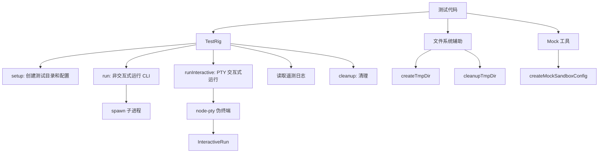

# test-utils 架构

> Gemini CLI 的测试工具库，提供文件系统辅助、集成测试脚手架和 Mock 工具。

## 概述

`test-utils` 是一个私有的工作区内部包，为 Gemini CLI 的集成测试和单元测试提供公共工具。它包含三个核心模块：文件系统测试辅助（创建/清理临时目录）、完整的集成测试脚手架（TestRig，管理 CLI 进程的生命周期和遥测数据解析）、以及 Mock 工具（创建沙箱配置等）。TestRig 是最复杂的组件，支持非交互式和交互式（PTY）两种 CLI 运行模式。

## 架构图



## 目录结构

```
packages/test-utils/
├── index.ts             # 包入口，导出 file-system-test-helpers
├── package.json         # 私有包，依赖 gemini-cli-core、node-pty、strip-ansi
├── src/
│   ├── index.ts         # 源码入口，导出所有模块
│   ├── file-system-test-helpers.ts  # 临时目录创建/清理
│   ├── test-rig.ts      # TestRig 集成测试脚手架
│   └── mock-utils.ts    # Mock 工具
├── tsconfig.json
└── vitest.config.ts
```

## 关键文件

| 文件 | 功能 |
|------|------|
| `index.ts` | 包入口 |
| `package.json` | 私有包配置，仅供内部 workspace 使用 |

## 内部依赖

- `src/file-system-test-helpers.ts` - 文件系统辅助
- `src/test-rig.ts` - 集成测试脚手架
- `src/mock-utils.ts` - Mock 工具

## 外部依赖

| 包名 | 用途 |
|------|------|
| `@google/gemini-cli-core` | GEMINI_DIR 常量、DEFAULT_GEMINI_MODEL 等 |
| `@lydell/node-pty` | 伪终端（PTY）实现，用于交互式测试 |
| `strip-ansi` | 移除 ANSI 转义码以便进行文本断言 |
| `vitest` | 测试框架（expect 断言） |
