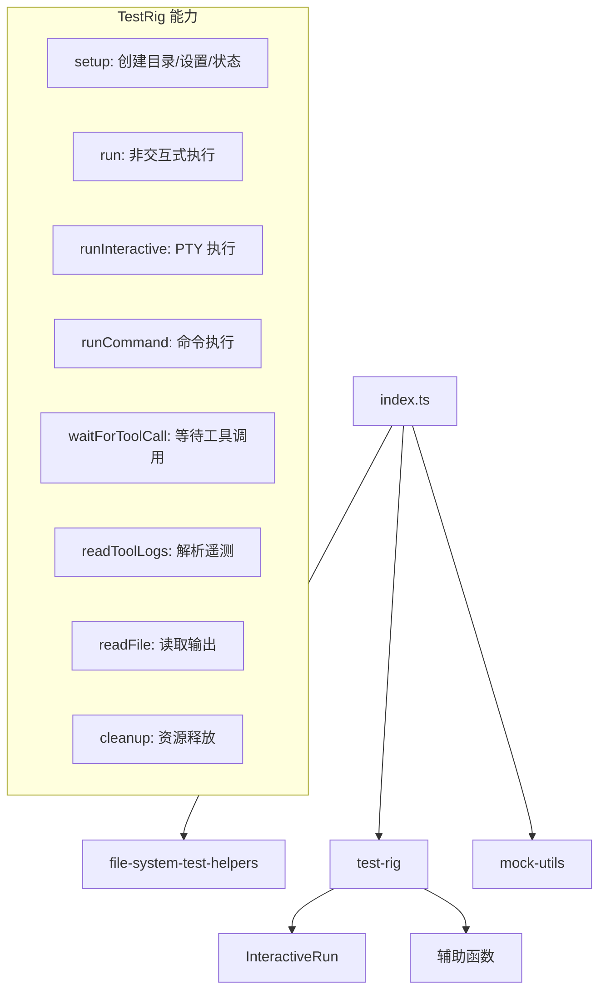

# test-utils/src 架构

> 测试工具源码目录，实现文件系统辅助、TestRig 集成测试脚手架和 Mock 工具。

## 概述

源码目录包含三个功能模块。`file-system-test-helpers.ts` 提供基于声明式结构创建临时测试目录的能力。`test-rig.ts` 是最核心的模块，实现了完整的 Gemini CLI 集成测试脚手架 `TestRig` 类和交互式运行控制器 `InteractiveRun`。`mock-utils.ts` 提供测试用的 Mock 对象创建工具。

## 架构图

## 关键文件

| 文件 | 功能 |
|------|------|
| `file-system-test-helpers.ts` | `FileSystemStructure` 类型：声明式文件结构（字符串为文件内容，对象为子目录，数组为目录含空文件）。`createTmpDir()` 在系统 tmpdir 下创建临时目录并递归填充。`cleanupTmpDir()` 递归删除 |
| `test-rig.ts` | `TestRig` 类：完整的集成测试脚手架。`setup()` 创建隔离的测试目录和 home 目录、写入 settings.json 和 state.json、复制 fake-responses 文件。`run()` 以 spawn 方式非交互式运行 CLI 并收集 stdout/stderr。`runInteractive()` 通过 node-pty 创建 PTY 进程返回 `InteractiveRun` 实例。`readToolLogs()` 从遥测日志文件或 stdout 中解析工具调用记录。`waitForToolCall()` 轮询等待特定工具被调用。`cleanup()` 杀死所有子进程并清理目录。`InteractiveRun` 类：封装 PTY 进程，提供 `expectText()`（等待文本出现）、`type()`（逐字符慢速输入）、`sendKeys()`（模拟按键）等交互控制方法。辅助函数：`poll()`（条件轮询）、`checkModelOutputContent()`（检查模型输出内容）、`getDefaultTimeout()`（环境感知超时） |
| `mock-utils.ts` | `createMockSandboxConfig()`：创建 SandboxConfig Mock 对象，支持部分覆盖 |

## 内部依赖

- `test-rig.ts` 使用 `@google/gemini-cli-core` 的 `GEMINI_DIR`、`DEFAULT_GEMINI_MODEL`
- `mock-utils.ts` 使用 `@google/gemini-cli-core` 的 `SandboxConfig` 类型

## 外部依赖

| 包名 | 用途 |
|------|------|
| `@google/gemini-cli-core` | GEMINI_DIR 常量、DEFAULT_GEMINI_MODEL、SandboxConfig 类型 |
| `@lydell/node-pty` | IPty 伪终端接口，用于交互式 CLI 测试 |
| `strip-ansi` | 移除 ANSI 转义码，使终端输出可用于文本匹配 |
| `vitest` | expect 断言工具 |
| `node:child_process` | spawn、execSync 子进程管理 |
| `node:fs` | 文件系统操作 |
| `node:os` | 临时目录路径、平台检测 |
