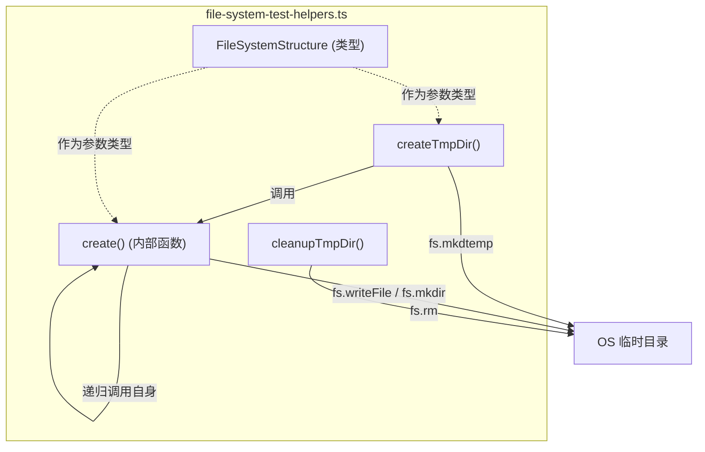

# file-system-test-helpers.ts

> 提供临时文件系统结构的声明式创建与清理，用于集成测试中的文件环境搭建。

## 概述

`file-system-test-helpers.ts` 是 `test-utils` 包中的文件系统辅助模块。它允许测试用例通过一个**声明式的 JavaScript 对象**来描述文件目录结构，然后自动在操作系统的临时目录中创建对应的文件和文件夹。测试完成后，还提供清理函数彻底删除这些临时文件。

设计动机：在集成测试中，经常需要创建包含特定文件内容的项目目录来模拟真实场景。手动使用 `fs.mkdir` / `fs.writeFile` 既繁琐又难以维护。该模块通过递归算法将声明式的结构描述转化为实际的文件系统操作，极大简化了测试环境的搭建。

在模块中的角色：这是 `test-utils` 包中最基础的工具，也是唯一被根 `index.ts` 直接导出的模块。`TestRig` 等高级工具间接依赖类似的文件系统操作能力。

## 架构图



## 主要导出

### `FileSystemStructure` (类型)

```typescript
export type FileSystemStructure = {
  [name: string]:
    | string                              // 文件内容
    | FileSystemStructure                 // 子目录
    | Array<string | FileSystemStructure>; // 目录内含空文件和/或子目录
};
```

定义虚拟文件系统的结构描述。键为文件/目录名，值的类型决定行为：
- **`string`**：创建一个文件，内容即为该字符串。
- **`FileSystemStructure`**（嵌套对象）：创建一个子目录，递归处理。
- **`Array<string | FileSystemStructure>`**：创建一个目录，数组中的字符串元素创建为空文件，对象元素递归处理为子目录。

示例：
```typescript
const structure: FileSystemStructure = {
  'file1.txt': 'Hello, world!',     // 创建文件，内容为 "Hello, world!"
  'empty-dir': [],                   // 创建空目录
  'src': {                           // 创建 src 子目录
    'main.js': '// Main file',
    'utils.ts': '// Utils',
  },
  'data': [                          // 创建 data 目录
    'users.csv',                     // 空文件
    { 'logs': ['error.log'] },       // 子目录 logs，含空文件 error.log
  ],
};
```

### `createTmpDir(structure: FileSystemStructure): Promise<string>`

在操作系统的临时目录下创建一个以 `gemini-cli-test-` 为前缀的唯一临时目录，并根据传入的 `FileSystemStructure` 填充其内容。返回该临时目录的绝对路径。

### `cleanupTmpDir(dir: string): Promise<void>`

递归删除指定的临时目录及其所有内容。使用 `force: true` 选项，即使目录不存在也不会抛出异常。

## 核心逻辑

### `create()` 内部递归函数

```typescript
async function create(dir: string, structure: FileSystemStructure)
```

这是文件系统创建的核心引擎，采用**深度优先递归**策略遍历 `FileSystemStructure` 对象：

1. 遍历结构对象的每个键值对 `[name, content]`
2. 计算目标路径：`path.join(dir, name)`
3. 根据 `content` 的类型分派操作：
   - **`typeof content === 'string'`**：调用 `fs.writeFile` 写入文件
   - **`Array.isArray(content)`**：先 `fs.mkdir` 创建目录，再遍历数组元素——字符串则创建空文件，对象则递归调用 `create`
   - **`typeof content === 'object' && content !== null`**：先 `fs.mkdir` 创建目录，再递归调用 `create` 处理子结构

所有目录创建使用 `{ recursive: true }` 选项，确保深层嵌套路径也能正确创建。

### `createTmpDir()` 流程

1. 通过 `os.tmpdir()` 获取系统临时目录路径
2. 使用 `fs.mkdtemp` 创建唯一前缀的临时目录（避免测试之间冲突）
3. 调用 `create()` 递归填充文件结构
4. 返回临时目录的绝对路径

## 内部依赖

无（此模块不依赖包内其他模块）。

## 外部依赖

| npm 包 / 内置模块 | 用途 |
|---|---|
| `node:fs/promises` | 异步文件系统操作（`writeFile`, `mkdir`, `mkdtemp`, `rm`） |
| `node:path` | 路径拼接（`path.join`） |
| `node:os` | 获取系统临时目录（`os.tmpdir()`） |
