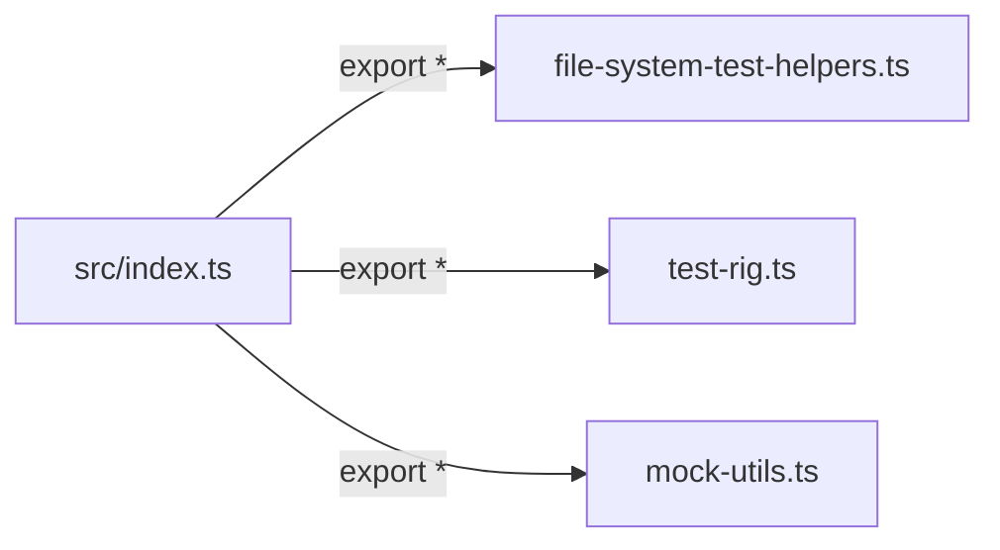

# src/index.ts

> `src` 目录的桶文件（barrel file），聚合并重导出所有内部模块。

## 概述

`src/index.ts` 是 `test-utils` 包 `src/` 目录下的**桶文件**，将三个核心模块的所有公开 API 统一重导出。当其他包通过子路径（如 `@google/gemini-cli-test-utils/src`）导入时，会经过此文件获取完整的测试工具集。

与根目录 `index.ts` 不同的是，此文件额外导出了 `test-rig` 和 `mock-utils` 两个模块，提供了更完整的 API 表面。

## 架构图



## 主要导出

此文件不定义新 API，全部来自以下三个模块的重导出：

| 来源模块 | 主要导出内容 |
|---|---|
| `./file-system-test-helpers.js` | `FileSystemStructure` (类型), `createTmpDir`, `cleanupTmpDir` |
| `./test-rig.js` | `TestRig`, `InteractiveRun`, `ParsedLog`, `poll`, `getDefaultTimeout`, `sanitizeTestName`, `normalizePath`, 以及多个断言/调试辅助函数 |
| `./mock-utils.js` | `createMockSandboxConfig` |

## 核心逻辑

无自身逻辑。仅包含三行重导出语句：

```typescript
export * from './file-system-test-helpers.js';
export * from './test-rig.js';
export * from './mock-utils.js';
```

## 内部依赖

| 模块 | 说明 |
|---|---|
| `./file-system-test-helpers.js` | 文件系统测试辅助工具 |
| `./test-rig.js` | 集成测试核心脚手架 |
| `./mock-utils.js` | Mock 工厂函数 |

## 外部依赖

无（所有外部依赖由被重导出的模块自行引入）。
