# test-rig.ts

> Gemini CLI 集成测试的核心脚手架，提供完整的测试环境搭建、CLI 进程管理、遥测日志解析与断言工具链。

## 概述

`test-rig.ts` 是 `test-utils` 包中**最重要、最复杂**的模块（约 1500 行），它为 Gemini CLI 的集成测试提供了一个全功能的测试基础设施。该模块的核心是 `TestRig` 类，它封装了以下完整的测试生命周期：

1. **环境搭建**：创建隔离的测试目录和模拟的 HOME 目录，自动生成 settings.json 和 state.json 配置文件
2. **CLI 执行**：支持批处理模式（`run`/`runCommand`）和交互式模式（`runInteractive`）运行 Gemini CLI
3. **遥测解析**：从遥测日志文件中解析工具调用记录、API 请求记录、Hook 调用记录和指标数据
4. **轮询等待**：提供带超时的异步轮询机制，等待特定遥测事件或工具调用完成
5. **环境清理**：自动终止残留进程、删除临时文件

设计动机：集成测试需要在隔离环境中启动真实的 CLI 进程，验证其行为是否符合预期。直接在测试用例中编写进程管理、环境变量清理、遥测解析等逻辑会导致大量重复代码。`TestRig` 将这些横切关注点集中封装，使测试用例可以专注于业务逻辑的验证。

在模块中的角色：`TestRig` 是整个集成测试体系的基石。几乎所有集成测试文件都会实例化一个 `TestRig`，在 `beforeEach` 中调用 `setup()`，在 `afterEach` 中调用 `cleanup()`。

## 架构图

```mermaid
graph TB
    subgraph "test-rig.ts 导出"
        direction TB
        TR["TestRig 类"]
        IR["InteractiveRun 类"]
        PL["ParsedLog 接口"]

        subgraph "独立辅助函数"
            GDT["getDefaultTimeout()"]
            POLL["poll()"]
            STN["sanitizeTestName()"]
            NP["normalizePath()"]
            CTCE["createToolCallErrorMessage()"]
            PDI["printDebugInfo()"]
            AMHO["assertModelHasOutput()"]
            CMOC["checkModelOutputContent()"]
        end
    end

    subgraph "内部辅助函数（未导出）"
        CE["contentExists()"]
        FMC["findMismatchedContent()"]
        LCW["logContentWarning()"]
        IO["isObject()"]
        DM["deepMerge()"]
    end

    subgraph "TestRig 内部结构"
        direction TB
        SETUP["setup()"]
        RUN["run()"]
        RC["runCommand()"]
        RWS["runWithStreams()"]
        RI["runInteractive()"]
        RTL["readToolLogs()"]
        RHL["readHookLogs()"]
        RAR["readAllApiRequest()"]
        RLR["readLastApiRequest()"]
        WTC["waitForToolCall()"]
        WTE["waitForTelemetryEvent()"]
        WM["waitForMetric()"]
        RM["readMetric()"]
        ETC["expectToolCallSuccess()"]
        WAT["waitForAnyToolCall()"]
        WFTR["waitForTelemetryReady()"]
        CLN["cleanup()"]
        PC["pollCommand()"]
        CF["createFile()"]
        CS["createScript()"]
        MD["mkdir()"]
        RF["readFile()"]
        SY["sync()"]
    end

    TR --> SETUP
    TR --> RUN
    TR --> RC
    TR --> RWS
    TR --> RI
    TR --> RTL
    TR --> CLN

    SETUP -->|"调用"| DM
    RUN -->|"内部调用"| TR_GCA["_getCommandAndArgs()"]
    RUN -->|"内部调用"| TR_GCE["_getCleanEnv()"]
    RUN -->|"内部调用"| TR_FPT["_filterPodmanTelemetry()"]
    RI -->|"创建"| IR
    RTL -->|"调用"| TR_RAPT["_readAndParseTelemetryLog()"]
    RTL -->|"回退"| TR_PTLS["_parseToolLogsFromStdout()"]
    WTC -->|"调用"| WFTR
    WTC -->|"调用"| POLL
    CMOC -->|"调用"| FMC
    FMC -->|"调用"| CE

    IR -->|"使用"| POLL
```



## 主要导出

### 独立辅助函数

#### `getDefaultTimeout(): number`

```typescript
export function getDefaultTimeout(): number
```

根据运行环境返回合适的超时时间（毫秒）：
- **CI 环境** (`env['CI']` 为真)：60000ms (1 分钟)
- **沙箱容器** (`env['GEMINI_SANDBOX']` 为真)：30000ms (30 秒)
- **本地开发**：15000ms (15 秒)

#### `poll(predicate, timeout, interval): Promise<boolean>`

```typescript
export async function poll(
  predicate: () => boolean,
  timeout: number,
  interval: number,
): Promise<boolean>
```

通用的**异步轮询**函数。在给定超时时间内，以指定间隔反复调用 `predicate`，直到其返回 `true` 或超时。超时时返回 `false`。当环境变量 `VERBOSE=true` 时，每 5 次尝试打印一次进度日志。

这是整个测试框架中等待异步条件的核心原语，被 `TestRig` 的 `waitForToolCall`、`waitForTelemetryEvent`、`waitForMetric` 等方法广泛使用。

#### `sanitizeTestName(name: string): string`

```typescript
export function sanitizeTestName(name: string): string
```

将测试名称转换为合法的文件系统路径片段：转小写、将非字母数字字符替换为 `-`、合并连续的 `-`。用于生成测试目录名。

#### `normalizePath(p: string | undefined): string | undefined`

```typescript
export function normalizePath(p: string | undefined): string | undefined
```

将路径中的反斜杠 `\` 替换为正斜杠 `/`，实现跨平台路径标准化。主要用于 Windows 兼容。

#### `createToolCallErrorMessage(expectedTools, foundTools, result): string`

```typescript
export function createToolCallErrorMessage(
  expectedTools: string | string[],
  foundTools: string[],
  result: string,
): string
```

生成详细的工具调用断言失败信息，包含期望的工具名、实际发现的工具名、以及输出预览（前 200 字符）。

#### `printDebugInfo(rig, result, context?): ToolLog[]`

```typescript
export function printDebugInfo(
  rig: TestRig,
  result: string,
  context: Record<string, unknown> = {},
): ToolLog[]
```

测试失败时的调试辅助函数。打印结果的首尾各 500 字符、附加上下文、以及所有工具调用日志。返回完整的工具日志数组。

#### `assertModelHasOutput(result: string): void`

```typescript
export function assertModelHasOutput(result: string): void
```

断言 LLM 返回了非空输出。若 `result` 为空或仅含空白字符，抛出错误。

#### `checkModelOutputContent(result, options?): boolean`

```typescript
export function checkModelOutputContent(
  result: string,
  options?: {
    expectedContent?: string | (string | RegExp)[] | null;
    testName?: string;
    forbiddenContent?: string | (string | RegExp)[] | null;
  },
): boolean
```

检查模型输出内容是否符合预期。支持两类检查：
- **expectedContent**：期望存在的内容（字符串不区分大小写匹配，正则精确匹配）
- **forbiddenContent**：禁止出现的内容

不满足条件时**不会抛出异常**，而是打印警告并返回 `false`。这是因为 LLM 输出具有不确定性，内容检查失败不一定代表功能缺陷。

---

### `ParsedLog` 接口

```typescript
export interface ParsedLog {
  attributes?: {
    'event.name'?: string;
    function_name?: string;
    function_args?: string;
    success?: boolean;
    duration_ms?: number;
    request_text?: string;
    hook_event_name?: string;
    hook_name?: string;
    hook_input?: Record<string, unknown>;
    hook_output?: Record<string, unknown>;
    exit_code?: number;
    stdout?: string;
    stderr?: string;
    error?: string;
    error_type?: string;
    prompt_id?: string;
  };
  scopeMetrics?: {
    metrics: {
      descriptor: {
        name: string;
      };
    }[];
  }[];
}
```

表示从遥测日志文件中解析出的单条日志记录。主要用于两种类型的遥测数据：
- **事件日志**（通过 `attributes` 字段）：包含工具调用、API 请求、Hook 调用等事件信息
- **指标数据**（通过 `scopeMetrics` 字段）：包含性能指标和计数器

---

### `InteractiveRun` 类

```typescript
export class InteractiveRun {
  ptyProcess: pty.IPty;
  public output: string;

  constructor(ptyProcess: pty.IPty);
  async expectText(text: string, timeout?: number): Promise<void>;
  async type(text: string): Promise<void>;
  async sendText(text: string): Promise<void>;
  async sendKeys(text: string): Promise<void>;
  async kill(): Promise<void>;
  expectExit(): Promise<number>;
}
```

封装一个基于伪终端（PTY）的交互式 CLI 会话。支持以下交互操作：

| 方法 | 说明 |
|---|---|
| `expectText(text, timeout?)` | 等待输出中出现指定文本（不区分大小写，自动去除 ANSI 转义码），超时则通过 vitest `expect` 断言失败 |
| `type(text)` | 逐字符慢速输入，每输入一个字符都等待回显确认。适合短命令，确保输入准确性。对回车符 `\r` 会额外等待 50ms 以避免快速回车转换问题 |
| `sendText(text)` | 一次性发送整段文本，不等待回显。适合需要快速发送的场景，但可能触发粘贴检测 |
| `sendKeys(text)` | 逐字符发送，每字符间隔 5ms。介于 `type` 和 `sendText` 之间，避免粘贴检测但不等待回显 |
| `kill()` | 终止 PTY 进程 |
| `expectExit()` | 等待进程退出（最长 60 秒），返回退出码 |

`output` 属性持续累积 PTY 输出。当 `KEEP_OUTPUT=true` 或 `VERBOSE=true` 时，同时将输出写到 `process.stdout`。

---

### `TestRig` 类

这是整个模块的核心。以下按生命周期阶段分组说明其公共 API。

#### 属性

| 属性 | 类型 | 说明 |
|---|---|---|
| `testDir` | `string \| null` | 测试工作目录路径 |
| `homeDir` | `string \| null` | 模拟的用户 HOME 目录路径 |
| `testName` | `string \| undefined` | 当前测试名称 |
| `fakeResponsesPath` | `string \| undefined` | 假响应文件路径（用于确定性重放） |
| `originalFakeResponsesPath` | `string \| undefined` | 原始假响应文件路径（用于 golden 更新） |

#### 环境搭建

##### `setup(testName, options?)`

```typescript
setup(
  testName: string,
  options?: {
    settings?: Record<string, unknown>;
    state?: Record<string, unknown>;
    fakeResponsesPath?: string;
  },
): void
```

初始化测试环境。这是使用 `TestRig` 的第一步，通常在 `beforeEach` 中调用。

**执行流程：**
1. 根据 `testName` 生成 sanitized 目录名
2. 在 `INTEGRATION_TEST_FILE_DIR` 或系统临时目录下创建 `testDir` 和 `homeDir`
3. 如果是首次初始化，清理可能残留的旧目录（支持重试场景）
4. 创建测试目录和 HOME 目录
5. 如果提供了 `fakeResponsesPath`，将假响应文件复制到测试目录（除非处于 `REGENERATE_MODEL_GOLDENS` 模式）
6. 调用 `_createSettingsFile()` 在项目级和用户级 `.gemini/` 目录下写入 settings.json
7. 调用 `_createStateFile()` 在用户级 `.gemini/` 目录下写入 state.json

**默认配置：** settings.json 中的默认值经过精心设计，确保测试环境的稳定性：
- `disableAutoUpdate: true`：防止 nightly 版本触发自动更新干扰测试
- `telemetry.enabled: true` + `telemetry.target: 'local'`：启用遥测但写入本地文件（而非远程服务）
- `security.auth.selectedType: 'gemini-api-key'`：使用 API Key 认证
- `security.folderTrust.enabled: false`：禁用文件夹信任检查
- `ui.useAlternateBuffer: true`：使用备用缓冲区
- `ide.enabled: false`：禁用 IDE 连接对话框

##### `createFile(fileName, content): string`

在 `testDir` 中创建文件，返回文件绝对路径。

##### `createScript(fileName, content): string`

在 `testDir` 中创建脚本文件，返回标准化后的文件路径（正斜杠）。在 `setup()` 之前调用会抛出异常。

##### `mkdir(dir): void`

在 `testDir` 中递归创建目录。

##### `sync(): void`

在非 Windows 平台上执行 `sync` 命令，确保文件系统写入完成后再启动子进程。

#### CLI 执行

##### `run(options): Promise<string>`

```typescript
run(options: {
  args?: string | string[];
  stdin?: string;
  stdinDoesNotEnd?: boolean;
  approvalMode?: 'default' | 'auto_edit' | 'yolo' | 'plan';
  timeout?: number;
  env?: Record<string, string | undefined>;
}): Promise<string>
```

以批处理模式运行 Gemini CLI。这是最常用的执行方法。

**执行流程：**
1. 通过 `_getCommandAndArgs()` 确定可执行文件和初始参数
2. 设置 approval mode（默认 `yolo`）
3. 通过 `_getCleanEnv()` 构建干净的环境变量集
4. 使用 `spawn` 启动子进程，将进程引用存入 `_spawnedProcesses`
5. 可选写入 stdin 输入
6. 累积 stdout 和 stderr 输出
7. 设置超时定时器（默认 300 秒）
8. 进程正常退出（code 0）时：
   - 过滤 Podman 遥测输出（`_filterPodmanTelemetry`）
   - 非 JSON 输出模式下附加 stderr
   - resolve 最终结果字符串
9. 进程异常退出时 reject 错误

##### `runCommand(args, options?): Promise<string>`

```typescript
runCommand(
  args: string[],
  options?: {
    stdin?: string;
    timeout?: number;
    env?: Record<string, string | undefined>;
  },
): Promise<string>
```

与 `run()` 类似，但参数结构更简洁。不设置 approval mode，直接将 `args` 追加到命令行参数中。适合测试 CLI 的子命令（如 `gemini config`）。

##### `runWithStreams(args, options?): Promise<{stdout, stderr, exitCode}>`

```typescript
runWithStreams(
  args: string[],
  options?: { signal?: AbortSignal },
): Promise<{ stdout: string; stderr: string; exitCode: number | null }>
```

以分离的 stdout/stderr 流运行 CLI。与 `run()` 不同的是，它不合并输出，而是分别返回 stdout、stderr 和退出码。适合需要验证输出流路由正确性的测试。支持通过 `AbortSignal` 取消。

##### `runInteractive(options?): Promise<InteractiveRun>`

```typescript
runInteractive(options?: {
  args?: string | string[];
  approvalMode?: 'default' | 'auto_edit' | 'yolo' | 'plan';
  env?: Record<string, string | undefined>;
}): Promise<InteractiveRun>
```

以交互式模式运行 CLI，返回一个 `InteractiveRun` 实例。

**执行流程：**
1. 确定命令和参数
2. 构建环境变量，Windows 下额外注入系统关键变量（`SystemRoot`, `COMSPEC` 等）
3. 通过 `node-pty` 创建伪终端进程，配置 80x80 的终端尺寸
4. 用 `InteractiveRun` 封装 PTY 进程
5. **等待应用就绪**：调用 `run.expectText('Type your message or @path/to/file', 30000)` 确认 CLI 已启动
6. 返回 `InteractiveRun` 实例

#### 文件操作

##### `readFile(fileName): string`

读取 `testDir` 中的文件内容。`KEEP_OUTPUT=true` 或 `VERBOSE=true` 时打印文件内容。

#### 遥测与日志

##### `waitForTelemetryReady(): Promise<void>`

等待遥测日志文件存在且包含有意义的内容（至少包含 `"scopeMetrics"` 字符串）。最长等待 2 秒，每 100ms 检查一次。

##### `waitForTelemetryEvent(eventName, timeout?): Promise<boolean>`

等待特定的遥测事件出现。`eventName` 会自动加上 `gemini_cli.` 前缀。

##### `waitForToolCall(toolName, timeout?, matchArgs?): Promise<boolean>`

等待特定工具调用出现在遥测日志中。可选的 `matchArgs` 回调用于进一步过滤工具参数。

##### `expectToolCallSuccess(toolNames, timeout?, matchArgs?): Promise<void>`

等待并**断言**指定的工具调用成功完成（`success === true`）。如果超时未找到，通过 vitest `expect` 断言失败。

##### `waitForAnyToolCall(toolNames, timeout?): Promise<boolean>`

等待工具名列表中的**任意一个**出现在遥测日志中。

##### `readToolLogs(): ToolLog[]`

读取并解析所有工具调用日志。返回结构化的工具调用记录数组，每条记录包含 `name`、`args`、`success`、`duration_ms`、`prompt_id`、`error`、`error_type`。

**Podman 容器特殊处理：** 在 Podman 沙箱环境中，遥测可能无法正常写入文件。此方法实现了智能回退策略：
1. 首先尝试从遥测日志文件读取
2. 如果文件为空或不包含事件数据，回退到从 stdout 输出中解析
3. 通过正则表达式和 JSON 解析两种策略从 stdout 提取工具调用信息

##### `readHookLogs(): HookLog[]`

读取并解析所有 Hook 调用日志。返回结构化的 Hook 记录数组，包含 `hook_event_name`、`hook_name`、`hook_input`、`hook_output`、`exit_code`、`stdout`、`stderr`、`duration_ms`、`success`、`error`。

##### `readAllApiRequest(): ParsedLog[]`

读取所有 `gemini_cli.api_request` 类型的遥测日志。

##### `readLastApiRequest(): ParsedLog | null`

读取最后一条 API 请求遥测日志。

##### `waitForMetric(metricName, timeout?): Promise<boolean>`

等待指定的指标出现在遥测日志中。`metricName` 如果不以 `gemini_cli.` 开头会自动加前缀。

##### `readMetric(metricName): Record<string, unknown> | null`

立即读取指定指标数据。返回指标对象或 `null`。

#### 清理

##### `cleanup(): Promise<void>`

清理测试环境。通常在 `afterEach` 中调用。

**执行流程：**
1. 遍历并终止所有活跃的 `InteractiveRun`（Windows 下使用 `taskkill /F /T`）
2. 遍历并终止所有残留的子进程
3. 如果处于 `REGENERATE_MODEL_GOLDENS` 模式，将更新后的假响应文件复制回原始位置
4. 除非 `KEEP_OUTPUT` 为真，递归删除 `testDir` 和 `homeDir`

##### `pollCommand(commandFn, predicateFn, timeout?, interval?): Promise<void>`

反复执行命令函数并检查谓词函数，直到谓词返回 `true` 或超时。与 `poll` 不同的是，每次迭代都会执行一个异步命令。适合需要反复触发操作直到条件满足的场景。

## 核心逻辑

### 1. 环境隔离策略

`TestRig` 通过两个独立目录实现环境隔离：

- **`testDir`**：模拟项目工作目录，CLI 进程的 `cwd` 指向此处。包含项目级 `.gemini/settings.json`。
- **`homeDir`**：模拟用户 HOME 目录，通过 `GEMINI_CLI_HOME` 环境变量传递给 CLI 进程。包含用户级 `.gemini/settings.json`、`.gemini/state.json` 和遥测日志文件。

通过 `_getCleanEnv()` 方法清除所有可能干扰测试的 `GEMINI_*` 和 `GOOGLE_GEMINI_*` 环境变量（保留 `GEMINI_API_KEY`、`GOOGLE_API_KEY` 等必要变量），确保测试环境的纯净性。

### 2. 命令构建策略 (`_getCommandAndArgs`)

根据环境变量决定如何启动 CLI：

| 条件 | 命令 | 说明 |
|---|---|---|
| `INTEGRATION_TEST_GEMINI_BINARY_PATH` | 指定的二进制路径 | 直接使用预构建的二进制 |
| `INTEGRATION_TEST_USE_INSTALLED_GEMINI=true` | `gemini` / `gemini.cmd` | 测试 npm 发布包 |
| 默认 | `node bundle/gemini.js` | 使用本地 bundle |

如果存在 `fakeResponsesPath`，还会追加 `--fake-responses` 或 `--record-responses` 参数（取决于是否为 golden 重录模式）。

### 3. 深度合并 (`deepMerge`)

`_createSettingsFile` 和 `_createStateFile` 使用内部 `deepMerge` 函数将用户覆盖值与默认值合并。该函数实现了递归的对象深合并：
- 两个操作数都是对象时，递归合并各键
- 否则，`source` 值直接覆盖 `target`
- 数组不会被合并，而是整体替换

### 4. 目录清理重试 (`_cleanDir`)

`_cleanDir` 实现了带**指数退避重试**的目录删除：
- 最多重试 10 次
- 延迟为 `min(2^i * 1000ms, 10000ms)`，即 1s, 2s, 4s, 8s, 10s, 10s, ...
- 使用 `Atomics.wait` 实现同步等待（回退到忙等待）
- 这是为了应对 Windows 和 CI 环境中文件锁延迟释放的问题

### 5. Podman 遥测过滤 (`_filterPodmanTelemetry`)

在 Podman 沙箱环境中，容器内的遥测 JSON 对象可能混入 stdout。`_filterPodmanTelemetry` 通过跟踪花括号深度来识别并过滤这些 JSON 对象：
- 遇到独立的 `{` 行时进入过滤模式
- 跟踪 `{}` 嵌套深度
- 深度归零时结束过滤
- 非遥测行正常保留

### 6. 从 stdout 解析工具日志 (`_parseToolLogsFromStdout`)

这是 `readToolLogs` 在 Podman 环境下的回退策略，使用两阶段解析：

**阶段一 - 正则匹配：**
```
/body:\s*'Tool call:\s*([\w-]+)\..*?Success:\s*(\w+)\..*?Duration:\s*(\d+)ms\.'/g
```
从 Podman 的控制台输出格式中提取工具名、成功状态和耗时。同时在匹配位置前后 500 字符范围内搜索 `function_args` 和 `prompt_id`。

**阶段二 - JSON 解析（回退）：**
如果正则未匹配到任何结果，则逐行扫描 stdout，检测并解析完整的 JSON 对象，从中提取工具调用事件。

### 7. 遥测日志文件解析 (`_readAndParseTelemetryLog`)

遥测日志文件中包含多个紧邻的 JSON 对象（以 `}\n{` 分隔）。解析流程：
1. 读取 `homeDir/telemetry.log` 文件
2. 按 `}\n{` 分割字符串
3. 为每个片段补回缺失的花括号
4. 逐个尝试 `JSON.parse`，跳过无效片段
5. 返回 `ParsedLog[]` 数组

## 内部依赖

| 模块 | 导入内容 | 说明 |
|---|---|---|
| `@google/gemini-cli-core` | `DEFAULT_GEMINI_MODEL`, `GEMINI_DIR` | 获取默认模型名称和 `.gemini` 目录名常量。`GEMINI_DIR` 同时被重导出 |

## 外部依赖

| npm 包 / 内置模块 | 用途 |
|---|---|
| `vitest` | `expect` 断言函数，用于 `expectText` 和 `expectToolCallSuccess` |
| `@lydell/node-pty` | 伪终端（PTY）实现，用于交互式 CLI 测试 |
| `strip-ansi` | 去除 ANSI 转义码，用于对 PTY 输出进行文本匹配 |
| `node:child_process` | `execSync`（同步执行 `sync` 命令和 `taskkill`）、`spawn`（启动 CLI 子进程）、`ChildProcess` 类型 |
| `node:fs` | 同步文件操作：`mkdirSync`、`writeFileSync`、`readFileSync`、`existsSync`、`rmSync`、`copyFileSync` |
| `node:path` | `join`（路径拼接）、`dirname`（获取目录名） |
| `node:url` | `fileURLToPath`（将模块 URL 转为文件路径，用于计算 `__dirname`） |
| `node:process` | `env`（访问环境变量） |
| `node:timers/promises` | `setTimeout as sleep`（异步等待） |
| `node:os` | `platform()`（平台检测）、`tmpdir()`（临时目录路径） |
