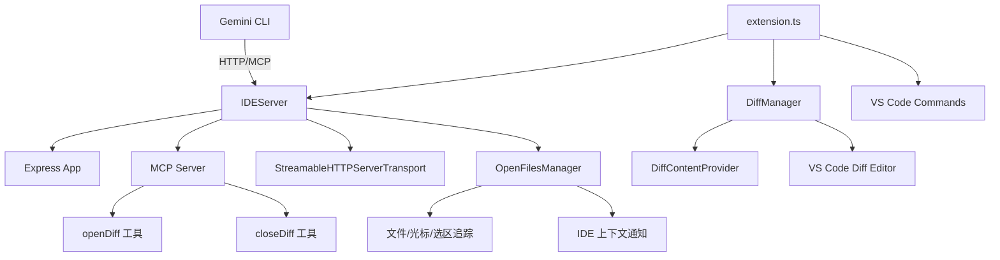

# vscode-ide-companion 架构

> VS Code 扩展，为 Gemini CLI 提供 IDE 集成能力，包括 MCP 服务器、Diff 视图管理和工作区状态感知。

## 概述

`vscode-ide-companion` 是一个 VS Code 扩展，作为 Gemini CLI 的 IDE 伴侣运行。它在 VS Code 中启动一个本地 MCP（Model Context Protocol）服务器，通过 Express + StreamableHTTP 传输层与 CLI 通信。扩展提供三大核心功能：(1) 通过 `openDiff`/`closeDiff` MCP 工具在 IDE 中展示文件变更的 Diff 视图，支持用户接受或拒绝修改；(2) 通过 `OpenFilesManager` 实时追踪工作区的打开文件、光标位置和选中文本，推送 IDE 上下文通知；(3) 管理认证令牌和端口文件，使 CLI 能自动发现并连接到 IDE。

## 架构图



## 目录结构

```
packages/vscode-ide-companion/
├── package.json         # VS Code 扩展清单（激活事件、命令、配置）
├── src/
│   ├── extension.ts     # 扩展入口（activate/deactivate）
│   ├── ide-server.ts    # MCP HTTP 服务器
│   ├── diff-manager.ts  # Diff 视图管理器
│   ├── open-files-manager.ts  # 打开文件状态管理
│   └── utils/
│       └── logger.ts    # 日志工具
├── assets/              # 扩展图标
├── scripts/             # 构建脚本
├── esbuild.js           # 构建配置
└── tsconfig.json
```

## 关键文件

| 文件 | 功能 |
|------|------|
| `package.json` | 扩展清单：定义激活事件（onStartupFinished）、命令（diff.accept/cancel、runGeminiCLI、showNotices）、快捷键、配置项（debug logging） |
| `src/extension.ts` | 扩展入口 |
| `src/ide-server.ts` | MCP 服务器 |
| `src/diff-manager.ts` | Diff 视图管理 |
| `src/open-files-manager.ts` | 工作区状态追踪 |

## 内部依赖

- `src/extension.ts` - 入口，协调所有模块
- `src/ide-server.ts` - 核心服务器
- `src/diff-manager.ts` - Diff 管理
- `src/open-files-manager.ts` - 文件追踪
- `src/utils/logger.ts` - 日志

## 外部依赖

| 包名 | 用途 |
|------|------|
| `@modelcontextprotocol/sdk` | MCP 协议 SDK（McpServer、StreamableHTTPServerTransport） |
| `express` | HTTP 服务框架 |
| `cors` | CORS 安全中间件 |
| `zod` | Schema 验证 |
| `@google/gemini-cli-core` | IDE 类型定义、tmpdir 等工具 |
| `vscode` | VS Code 扩展 API（devDependency） |
