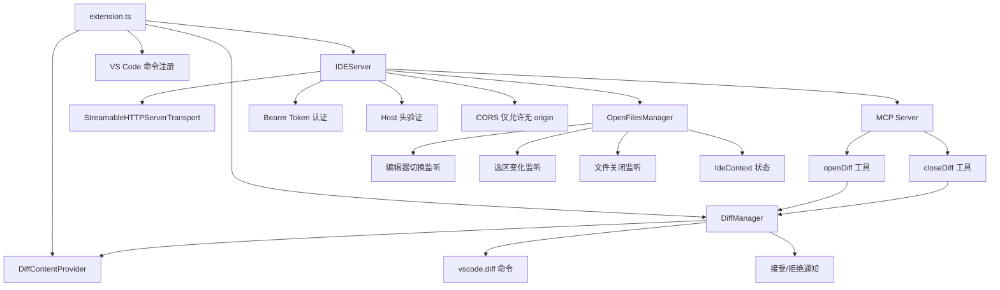

# vscode-ide-companion/src 架构

> VS Code 扩展源码目录，实现扩展生命周期、MCP 服务器、Diff 管理和工作区状态追踪。

## 概述

源码目录包含 5 个文件，实现了 VS Code 扩展的完整功能。`extension.ts` 是扩展入口，管理激活/停用生命周期、版本更新检查和命令注册。`ide-server.ts` 是核心服务器，创建 Express 应用并通过 MCP 协议与 CLI 通信，处理认证、CORS 安全和会话管理。`diff-manager.ts` 管理 IDE 中 Diff 视图的创建、接受和取消。`open-files-manager.ts` 追踪工作区中打开的文件、光标位置和选中文本，生成 IDE 上下文供 CLI 使用。

## 架构图

## 关键文件

| 文件 | 功能 |
|------|------|
| `extension.ts` | 扩展入口：`activate()` 创建 OutputChannel 日志、DiffContentProvider、DiffManager、IDEServer 并启动。注册 `gemini.diff.accept`/`cancel`/`gemini-cli.runGeminiCLI`/`showNotices` 命令。监听工作区变化同步环境变量。`checkForUpdates()` 从 VS Code Marketplace 检查新版本。检测 Firebase Studio/Cloud Shell 等托管环境 |
| `ide-server.ts` | `IDEServer` 类：`start()` 创建 Express 应用，配置安全中间件（Bearer Token 认证、Host 头验证、CORS 仅允许无 origin 请求）。创建 MCP Server 并注册 `openDiff` 和 `closeDiff` 两个工具。管理多个 StreamableHTTPServerTransport 会话，每个会话有 60s keep-alive ping。将端口、工作区路径、认证令牌写入环境变量和 port 文件。`syncEnvVars()` 在工作区变化时更新。`broadcastIdeContextUpdate()` 向所有活跃会话推送上下文更新 |
| `diff-manager.ts` | `DiffContentProvider`：实现 VS Code TextDocumentContentProvider 接口，管理 `gemini-diff://` scheme 的虚拟文档内容。`DiffManager` 类：`showDiff()` 打开 Diff 编辑器（原始文件 vs 修改后内容），支持新文件创建。`acceptDiff()` 用户接受后发送 `ide/diffAccepted` JSONRPC 通知。`cancelDiff()` 用户取消后发送 `ide/diffRejected` 通知。追踪活跃编辑器更新 `gemini.diff.isVisible` 上下文 |
| `open-files-manager.ts` | `OpenFilesManager` 类：追踪最近打开的 10 个文件（LRU 顺序），监听编辑器切换、选区变化、文件关闭/删除/重命名事件。活跃文件记录光标位置和选中文本（最大 16KB）。通过 50ms 防抖的 `onDidChange` 事件通知变化。`state` getter 返回 `IdeContext` 对象 |
| `utils/logger.ts` | `createLogger()` 工厂函数：仅在开发模式或启用 `gemini-cli.debug.logging.enabled` 配置时输出日志到 OutputChannel |

## 内部依赖

- `extension.ts` 依赖 `ide-server.ts`、`diff-manager.ts`、`utils/logger.ts`
- `ide-server.ts` 依赖 `diff-manager.ts`、`open-files-manager.ts`
- `diff-manager.ts` 依赖 `extension.ts`（DIFF_SCHEME 常量）

## 外部依赖

| 包名 | 用途 |
|------|------|
| `vscode` | VS Code 扩展 API（命令、窗口、工作区、文档等） |
| `@modelcontextprotocol/sdk` | MCP 协议：McpServer、StreamableHTTPServerTransport、isInitializeRequest |
| `express` | HTTP 服务框架 |
| `cors` | CORS 中间件 |
| `@google/gemini-cli-core` | IDE 类型（OpenDiffRequestSchema、CloseDiffRequestSchema、IdeContextNotificationSchema、IdeContext、File）、tmpdir、detectIdeFromEnv |
| `semver` | 语义化版本比较（版本更新检查） |
| `zod` | 请求 schema 类型推断 |
