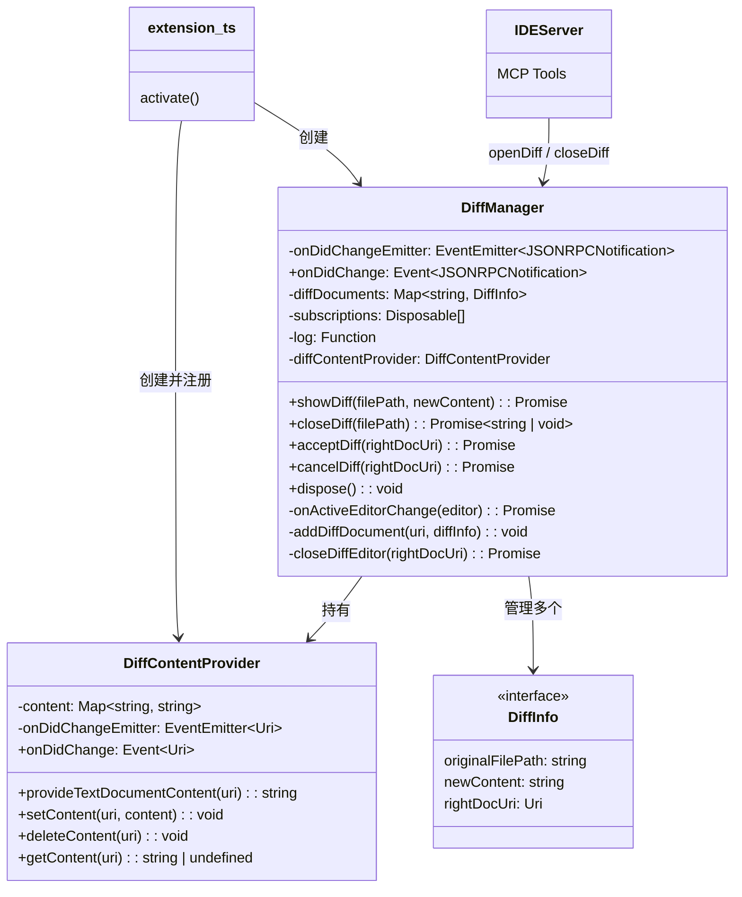

# diff-manager.ts

> 管理 VS Code 中 Gemini Diff 视图的完整生命周期，包括创建、接受、取消和关闭操作。

## 概述

`diff-manager.ts` 负责在 VS Code 编辑器中展示和管理 diff 视图。当 Gemini CLI 通过 MCP 协议请求对文件进行修改时，本模块会在 IDE 中创建一个双栏 diff 视图，左侧显示原始文件内容，右侧显示 AI 生成的新内容。用户可以在右侧编辑器中进一步修改，然后选择「接受」或「取消」。

该模块包含两个核心类：
- **`DiffContentProvider`** -- 实现 VS Code 的 `TextDocumentContentProvider` 接口，为自定义 `gemini-diff` URI scheme 提供虚拟文档内容。
- **`DiffManager`** -- 管理所有活跃 diff 视图的状态，协调打开/关闭/接受/取消操作，并通过事件机制将结果通知给 IDE 服务器。

设计上，diff 视图的右侧（修改后内容）使用虚拟文档，而左侧使用实际文件 URI（若文件存在）或 `untitled` scheme（若文件不存在），从而支持新建文件的场景。

## 架构图



## 主要导出

### `class DiffContentProvider`

```typescript
export class DiffContentProvider implements vscode.TextDocumentContentProvider
```

为 `gemini-diff` scheme 提供虚拟文档内容的提供器。

| 方法 | 签名 | 说明 |
|------|------|------|
| `provideTextDocumentContent` | `(uri: Uri) => string` | VS Code 调用此方法获取虚拟文档内容 |
| `setContent` | `(uri: Uri, content: string) => void` | 设置指定 URI 的内容并触发 `onDidChange` 事件 |
| `deleteContent` | `(uri: Uri) => void` | 删除指定 URI 的缓存内容 |
| `getContent` | `(uri: Uri) => string \| undefined` | 获取指定 URI 的缓存内容 |

内部使用 `Map<string, string>` 以 URI 字符串为键存储虚拟文档内容。

---

### `class DiffManager`

```typescript
export class DiffManager
```

Diff 视图的核心管理器。

#### 构造函数

```typescript
constructor(
  private readonly log: (message: string) => void,
  private readonly diffContentProvider: DiffContentProvider,
)
```

构造时会自动订阅 `onDidChangeActiveTextEditor` 事件以维护 `gemini.diff.isVisible` 上下文变量。

#### 公开事件

| 事件 | 类型 | 说明 |
|------|------|------|
| `onDidChange` | `Event<JSONRPCNotification>` | diff 被接受或拒绝时触发，携带 MCP 通知消息 |

#### 公开方法

| 方法 | 签名 | 说明 |
|------|------|------|
| `showDiff` | `(filePath: string, newContent: string) => Promise<void>` | 创建并展示 diff 视图 |
| `closeDiff` | `(filePath: string) => Promise<string \| undefined>` | 按原始文件路径关闭 diff 视图，返回修改后的内容 |
| `acceptDiff` | `(rightDocUri: Uri) => Promise<void>` | 用户接受 diff，发出 `ide/diffAccepted` 通知 |
| `cancelDiff` | `(rightDocUri: Uri) => Promise<void>` | 用户取消 diff，发出 `ide/diffRejected` 通知 |
| `dispose` | `() => void` | 清理所有订阅 |

## 核心逻辑

### 1. 创建 Diff 视图 (`showDiff`)

```
输入: filePath (原始文件路径), newContent (AI 生成的新内容)
  ↓
1. 创建右侧虚拟文档 URI (gemini-diff scheme + 随机 query 防缓存)
2. 通过 DiffContentProvider.setContent 设置右侧内容
3. 将 DiffInfo 记录到 diffDocuments Map
4. 设置 gemini.diff.isVisible 上下文为 true
5. 判断原始文件是否存在:
   - 存在 → 左侧使用 file:// URI
   - 不存在 → 左侧使用 untitled: URI (空文档)
6. 调用 vscode.diff 命令打开双栏 diff 视图
7. 设置编辑器为可写 (允许用户编辑右侧内容)
```

### 2. 接受 Diff (`acceptDiff`)

```
输入: rightDocUri (右侧虚拟文档 URI)
  ↓
1. 从 diffDocuments Map 查找对应的 DiffInfo
2. 获取右侧文档的最新文本 (包含用户编辑)
3. 关闭 diff 编辑器标签页
4. 触发 onDidChange 事件, 发出 ide/diffAccepted 通知
   (包含 filePath 和 modifiedContent)
```

### 3. 取消 Diff (`cancelDiff`)

```
输入: rightDocUri (右侧虚拟文档 URI)
  ↓
1. 从 diffDocuments Map 查找对应的 DiffInfo
2. 获取右侧文档的最新文本
3. 关闭 diff 编辑器标签页
4. 触发 onDidChange 事件, 发出 ide/diffRejected 通知
   (同样包含 filePath 和 modifiedContent，以便 CLI 参考)
```

### 4. 关闭 Diff 编辑器 (`closeDiffEditor`)

私有方法，负责底层清理：

1. 设置 `gemini.diff.isVisible` 上下文为 `false`。
2. 从 `diffDocuments` Map 中移除记录。
3. 从 `DiffContentProvider` 中删除虚拟文档内容。
4. 遍历所有标签页组，找到匹配的 `TabInputTextDiff` 标签页并关闭。

### 5. 活跃编辑器变更监听 (`onActiveEditorChange`)

维护 `gemini.diff.isVisible` VS Code 上下文变量：当用户切换到 diff 视图相关的编辑器时设为 `true`，否则设为 `false`。该上下文变量用于控制 diff 相关按钮（接受/取消）的显示。

判断逻辑：检查当前活跃编辑器的文档 URI 是否在 `diffDocuments` Map 中（直接匹配右侧 URI 或通过 `originalFilePath` 匹配左侧文件）。

## 内部依赖

| 模块 | 导入内容 | 用途 |
|------|---------|------|
| `./extension.js` | `DIFF_SCHEME` | 自定义 URI scheme 常量 |

## 外部依赖

| 包名 | 导入内容 | 用途 |
|------|---------|------|
| `vscode` | VS Code 扩展 API | 文档内容提供器、diff 命令、标签页管理、事件系统 |
| `@google/gemini-cli-core` | `IdeDiffAcceptedNotificationSchema`, `IdeDiffRejectedNotificationSchema` | diff 接受/拒绝通知的 Zod schema |
| `@modelcontextprotocol/sdk` | `JSONRPCNotification`（类型导入） | MCP 通知消息类型 |
| `node:path` | `path` | 提取文件名（`path.basename`） |
