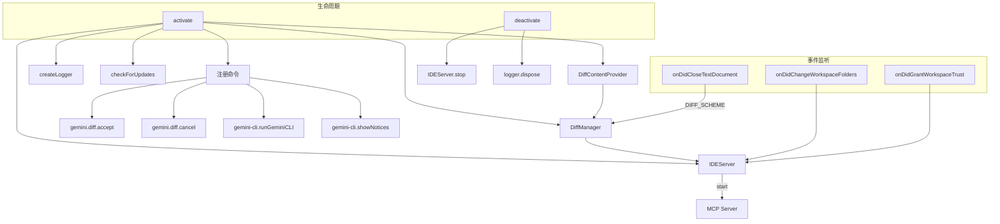

# extension.ts

> VS Code 扩展的入口文件，负责激活/停用生命周期、注册命令、启动 IDE 服务器并管理 Diff 视图。

## 概述

`extension.ts` 是 `vscode-ide-companion` 扩展包的主入口模块，实现了 VS Code 扩展所要求的 `activate` 和 `deactivate` 两个生命周期函数。它的核心职责包括：

1. **初始化日志系统** -- 创建 OutputChannel 并通过 `createLogger` 生成条件化的日志函数。
2. **版本更新检测** -- 启动时异步查询 VS Code Marketplace API，比较当前版本与最新版本，提示用户升级。
3. **Diff 视图管理** -- 实例化 `DiffContentProvider` 和 `DiffManager`，注册 `gemini-diff` 自定义 URI scheme 以及接受/取消 diff 的命令。
4. **IDE 服务器启动** -- 创建 `IDEServer` 实例并启动，用于与 Gemini CLI 进行 MCP 协议通信。
5. **注册用户命令** -- 提供「运行 Gemini CLI」和「显示 Notices」等命令。
6. **环境变量同步** -- 监听工作区文件夹变更和信任状态变更，及时同步环境变量。

该文件还区分了「托管扩展表面」（Firebase Studio、Cloud Shell 等由 IDE 自动安装管理的环境）和普通用户安装环境，在更新提示和首次安装消息方面有不同的行为。

## 架构图



## 主要导出

### `DIFF_SCHEME`

```typescript
export const DIFF_SCHEME = 'gemini-diff';
```

自定义 URI scheme 常量，用于标识 Gemini Diff 视图的虚拟文档。被 `DiffContentProvider` 注册为文档内容提供器的 scheme，也被各命令处理程序用于判断当前文档是否属于 diff 视图。

---

### `activate(context: vscode.ExtensionContext): Promise<void>`

```typescript
export async function activate(context: vscode.ExtensionContext): Promise<void>
```

扩展激活入口。执行以下操作：

1. 创建 `OutputChannel` 和日志函数。
2. 检测当前是否为托管扩展表面（Firebase Studio / Cloud Shell）。
3. 异步检查版本更新（不阻塞激活流程）。
4. 实例化 `DiffContentProvider` 和 `DiffManager`，注册到 `context.subscriptions`。
5. 注册 `gemini.diff.accept` 和 `gemini.diff.cancel` 命令。
6. 创建并启动 `IDEServer`。
7. 首次安装时显示提示信息（仅非托管环境）。
8. 监听工作区文件夹和信任变更，同步环境变量。
9. 注册 `gemini-cli.runGeminiCLI` 和 `gemini-cli.showNotices` 命令。

---

### `deactivate(): Promise<void>`

```typescript
export async function deactivate(): Promise<void>
```

扩展停用入口。负责：

1. 停止 `IDEServer`（关闭 HTTP 服务、清理端口文件、清空环境变量集合）。
2. 销毁 `OutputChannel` 日志通道。

## 核心逻辑

### 版本更新检测 (`checkForUpdates`)

```typescript
async function checkForUpdates(
  context: vscode.ExtensionContext,
  log: (message: string) => void,
  isManagedExtensionSurface: boolean,
): Promise<void>
```

流程：

1. 从 `context.extension.packageJSON.version` 获取当前版本号。
2. 向 VS Code Marketplace Gallery API (`/_apis/public/gallery/extensionquery`) 发起 POST 请求，按扩展标识符 `Google.gemini-cli-vscode-ide-companion` 查询。
3. 从返回结果中提取最新版本号（versions 按日期降序排列，取第一个）。
4. 使用 `semver.gt` 比较：若最新版本高于当前版本，且非托管环境，则弹出信息提示让用户选择「Update to latest version」。
5. 用户确认后调用 `workbench.extensions.installExtension` 命令自动更新。

### 命令：运行 Gemini CLI (`gemini-cli.runGeminiCLI`)

1. 检查是否有打开的工作区文件夹，若无则提示用户打开文件夹。
2. 若有多个工作区文件夹，弹出选择器让用户选择。
3. 在选定文件夹下创建终端并执行 `gemini` 命令。

### Diff 文档关闭监听

当 `gemini-diff` scheme 的虚拟文档被关闭时，自动调用 `diffManager.cancelDiff` 进行清理。

### 环境变量同步

监听 `onDidChangeWorkspaceFolders` 和 `onDidGrantWorkspaceTrust` 事件，触发 `ideServer.syncEnvVars()` 以确保 CLI 侧能获取最新的端口、工作区路径等信息。

## 内部依赖

| 模块 | 导入内容 | 用途 |
|------|---------|------|
| `./ide-server.js` | `IDEServer` | IDE MCP 服务器 |
| `./diff-manager.js` | `DiffContentProvider`, `DiffManager` | Diff 视图管理 |
| `./utils/logger.js` | `createLogger` | 条件化日志工厂 |

## 外部依赖

| 包名 | 导入内容 | 用途 |
|------|---------|------|
| `vscode` | VS Code 扩展 API | 扩展生命周期、命令、UI 交互 |
| `semver` | `semver` | 语义化版本比较 |
| `@google/gemini-cli-core` | `detectIdeFromEnv`, `IDE_DEFINITIONS`, `IdeInfo` | IDE 环境检测 |
