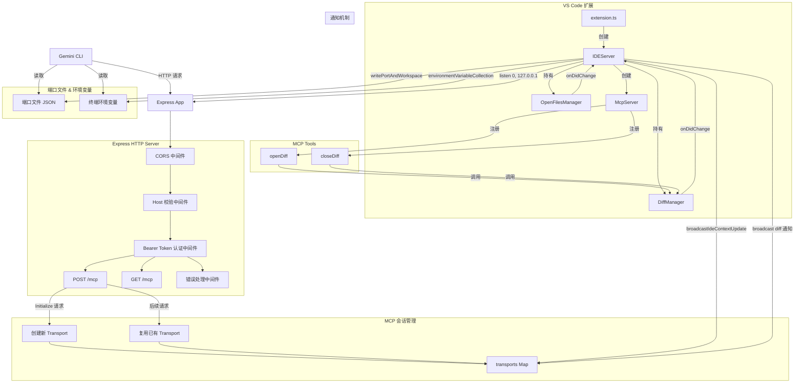

# ide-server.ts

> 基于 Express + MCP 协议的本地 HTTP 服务器，为 Gemini CLI 提供 IDE 集成能力（Diff 视图、工作区上下文推送等）。

## 概述

`ide-server.ts` 是 `vscode-ide-companion` 扩展中最核心的模块（约 480 行），实现了一个运行在 `127.0.0.1` 上的本地 HTTP 服务器。该服务器充当 Gemini CLI（命令行工具）与 VS Code IDE 之间的桥梁，基于 [Model Context Protocol (MCP)](https://modelcontextprotocol.io/) 进行双向通信。

**设计动机：** Gemini CLI 运行在终端中，无法直接访问 IDE 的编辑器状态。通过本地 HTTP 服务器 + MCP 协议，CLI 可以：
- 请求 IDE 打开 diff 视图展示文件修改
- 接收 IDE 推送的工作区上下文（当前打开的文件、光标位置、选中文本等）
- 关闭已打开的 diff 视图并获取用户编辑后的内容

**安全机制：** 服务器通过三层防护确保安全：
1. CORS 策略 -- 仅允许无 `origin` 的非浏览器请求
2. Host 头校验 -- 仅接受 `localhost` / `127.0.0.1` + 正确端口
3. Bearer Token 认证 -- 每次启动生成随机 UUID 作为 auth token

## 架构图



## 主要导出

### `class IDEServer`

IDE 本地 HTTP 服务器的核心类。

```typescript
export class IDEServer {
  diffManager: DiffManager;

  constructor(log: (message: string) => void, diffManager: DiffManager);
  start(context: vscode.ExtensionContext): Promise<void>;
  broadcastIdeContextUpdate(): void;
  syncEnvVars(): Promise<void>;
  stop(): Promise<void>;
}
```

#### 属性

| 属性 | 类型 | 可见性 | 说明 |
|------|------|--------|------|
| `server` | `HTTPServer \| undefined` | private | Node.js HTTP 服务器实例 |
| `context` | `vscode.ExtensionContext \| undefined` | private | VS Code 扩展上下文 |
| `log` | `(message: string) => void` | private | 日志函数 |
| `portFile` | `string \| undefined` | private | 端口文件路径 |
| `port` | `number \| undefined` | private | 服务器监听端口 |
| `authToken` | `string \| undefined` | private | Bearer Token（UUID） |
| `transports` | `Record<string, StreamableHTTPServerTransport>` | private | 活跃 MCP 会话映射表 |
| `openFilesManager` | `OpenFilesManager \| undefined` | private | 打开文件管理器 |
| `diffManager` | `DiffManager` | public | Diff 视图管理器 |

#### 方法

##### `start(context)`

启动服务器。流程：

1. 生成随机 `authToken`（UUID）。
2. 创建 Express 应用并依次挂载中间件：JSON body parser（10MB 限制）、CORS、Host 校验、Token 认证。
3. 创建 `McpServer` 并注册 `openDiff`、`closeDiff` 工具。
4. 实例化 `OpenFilesManager`，订阅其变更事件以广播上下文更新。
5. 订阅 `DiffManager` 的变更事件，将 diff 接受/拒绝通知转发给所有活跃 transport。
6. 注册 `POST /mcp`（处理 MCP 请求）和 `GET /mcp`（处理 SSE 流）路由。
7. 在 `127.0.0.1:0`（随机端口）上启动监听。
8. 启动后将端口、工作区路径、auth token 写入环境变量和端口文件。

##### `broadcastIdeContextUpdate()`

向所有活跃的 MCP transport 广播 IDE 上下文更新通知（当前打开文件列表、光标位置等）。

##### `syncEnvVars()`

重新写入环境变量和端口文件（在工作区文件夹变更或信任状态变更时调用），并广播上下文更新。

##### `stop()`

优雅关闭服务器：
1. 关闭 HTTP 服务器连接。
2. 清空扩展的环境变量集合。
3. 删除端口文件。

## 核心逻辑

### 1. MCP 会话生命周期

```
客户端首次请求 (无 session-id, Initialize 请求)
  → 创建 StreamableHTTPServerTransport
  → 分配新 sessionId (UUID)
  → 存入 transports Map
  → 连接 McpServer
  → 启动 Keep-Alive 定时器 (60s 间隔)

客户端后续请求 (携带 mcp-session-id header)
  → 从 transports Map 查找对应 transport
  → 委托 transport.handleRequest 处理

会话关闭 (transport.onclose)
  → 清除 Keep-Alive 定时器
  → 从 transports Map 移除
  → 从 sessionsWithInitialNotification Set 移除
```

### 2. Keep-Alive 机制

每个 MCP 会话创建后，启动一个 60 秒间隔的定时器发送 `ping` 通知。若连续 3 次 ping 失败，则认为连接已断开，停止 Keep-Alive（但不主动关闭连接）。

### 3. 初始上下文推送

当客户端首次通过 `GET /mcp` 建立 SSE 连接后，服务器会自动发送一次 `ide/contextUpdate` 通知，确保 CLI 获取到当前 IDE 状态。通过 `sessionsWithInitialNotification` Set 避免重复推送。

### 4. 端口发现机制

服务器启动后通过两种方式将连接信息暴露给 CLI：

- **环境变量**（通过 `environmentVariableCollection`）：
  - `GEMINI_CLI_IDE_SERVER_PORT` -- 服务器端口
  - `GEMINI_CLI_IDE_WORKSPACE_PATH` -- 工作区路径（多路径用 `path.delimiter` 分隔）
  - `GEMINI_CLI_IDE_AUTH_TOKEN` -- Bearer Token

- **端口文件**（JSON 格式，权限 `0o600`）：
  - 路径：`<tmpdir>/gemini/ide/gemini-ide-server-<ppid>-<port>.json`
  - 内容：`{ port, workspacePath, authToken }`

### 5. 安全中间件链

```
请求进入
  → [CORS] 拒绝携带 origin 的浏览器请求
  → [Host 校验] 仅允许 localhost:<port> 或 127.0.0.1:<port>
  → [Token 认证] 校验 Authorization: Bearer <token>
  → [路由处理]
```

### 6. MCP 工具注册 (`createMcpServer`)

```typescript
const createMcpServer = (diffManager: DiffManager, log: (message: string) => void) => McpServer
```

创建并配置 MCP 服务器，注册两个工具：

| 工具名 | 输入 Schema | 功能 |
|--------|------------|------|
| `openDiff` | `OpenDiffRequestSchema` (`filePath`, `newContent`) | 在 IDE 中打开 diff 视图 |
| `closeDiff` | `CloseDiffRequestSchema` (`filePath`) | 关闭指定文件的 diff 视图，返回用户编辑后的内容 |

## 内部依赖

| 模块 | 导入内容 | 用途 |
|------|---------|------|
| `./diff-manager.js` | `DiffManager`（类型导入） | Diff 视图管理，MCP 工具调用目标 |
| `./open-files-manager.js` | `OpenFilesManager` | 追踪打开文件状态，生成 IDE 上下文 |

## 外部依赖

| 包名 | 导入内容 | 用途 |
|------|---------|------|
| `vscode` | VS Code 扩展 API | 扩展上下文、环境变量集合、工作区信息 |
| `express` | `express`, `Request`, `Response`, `NextFunction` | HTTP 服务器框架 |
| `cors` | `cors` | CORS 中间件 |
| `@modelcontextprotocol/sdk` | `McpServer`, `StreamableHTTPServerTransport`, `isInitializeRequest` | MCP 协议服务端实现 |
| `@google/gemini-cli-core` | `CloseDiffRequestSchema`, `IdeContextNotificationSchema`, `OpenDiffRequestSchema`, `tmpdir` | IDE 通信类型定义、临时目录 |
| `zod` | `z`（类型导入） | Schema 类型推导 |
| `node:crypto` | `randomUUID` | 生成 auth token 和 session ID |
| `node:http` | `Server`（类型导入） | HTTP 服务器类型 |
| `node:path` | `path` | 路径拼接 |
| `node:fs/promises` | `fs` | 文件读写（端口文件） |
