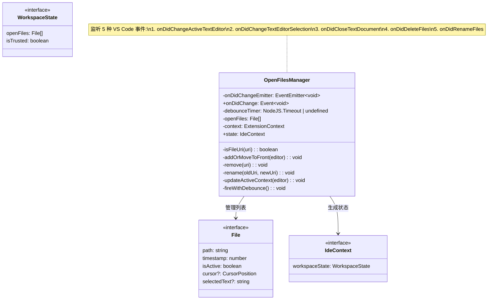
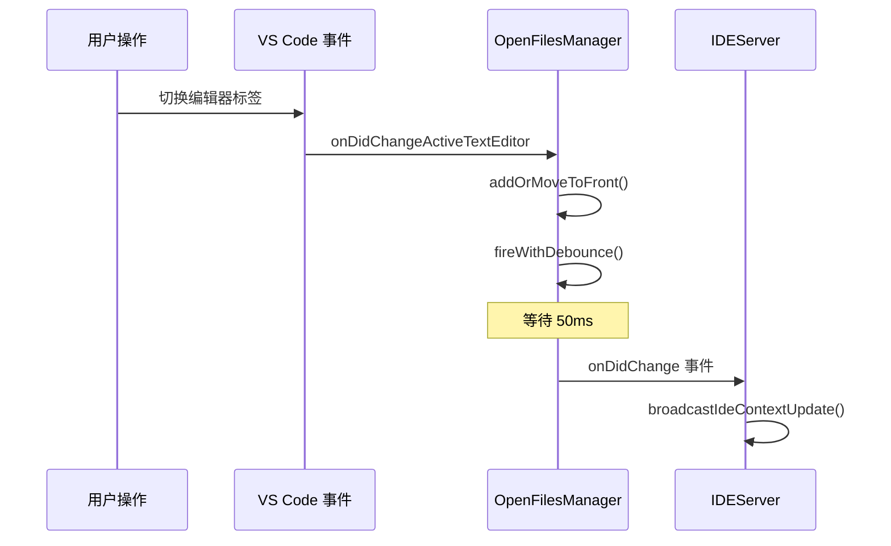

# open-files-manager.ts

> 追踪 VS Code 工作区中打开的文件、光标位置和选中文本，为 Gemini CLI 提供实时 IDE 上下文。

## 概述

`open-files-manager.ts` 实现了一个工作区状态追踪器 `OpenFilesManager`，它持续监控用户在 VS Code 中的编辑器活动，维护一个最近打开文件的有序列表（最多 10 个），并追踪当前活跃文件的光标位置和选中文本。

**设计动机：** Gemini CLI 需要了解用户当前在 IDE 中的工作上下文（正在编辑哪些文件、光标在哪里、选中了什么代码），以便提供更精准的代码建议。`OpenFilesManager` 将这些状态封装为 `IdeContext` 对象，通过 `IDEServer` 的 MCP 通知机制推送给 CLI。

**关键设计决策：**
- 使用 **LRU（最近最少使用）** 策略管理文件列表，最近激活的文件排在最前。
- 通过 **50ms 防抖** 避免高频事件导致过多通知。
- 选中文本限制 **16KB** 防止传输过大的数据。
- 仅追踪 `file://` scheme 的文档，排除虚拟文档、diff 视图等。

## 架构图





## 主要导出

### `MAX_FILES`

```typescript
export const MAX_FILES = 10;
```

打开文件列表的最大长度。超过此限制时，最久未激活的文件将被移除。

---

### `class OpenFilesManager`

```typescript
export class OpenFilesManager {
  readonly onDidChange: vscode.Event<void>;
  get state(): IdeContext;
  constructor(context: vscode.ExtensionContext);
}
```

#### 构造函数

```typescript
constructor(private readonly context: vscode.ExtensionContext)
```

初始化时：
1. 注册 5 个 VS Code 事件监听器（编辑器切换、选择变更、文档关闭、文件删除、文件重命名）。
2. 将所有监听器的 Disposable 推入 `context.subscriptions` 以确保清理。
3. 如果当前有活跃编辑器且为文件 URI，则将其加入列表。

#### 属性

| 属性 | 类型 | 说明 |
|------|------|------|
| `onDidChange` | `Event<void>` | 状态变更事件（防抖后触发） |
| `state` | `IdeContext`（getter） | 当前 IDE 上下文快照 |

#### `state` getter 返回结构

```typescript
{
  workspaceState: {
    openFiles: File[],    // 文件列表（深拷贝）
    isTrusted: boolean    // 工作区是否受信任
  }
}
```

## 核心逻辑

### 1. 文件列表管理（LRU 策略）

#### `addOrMoveToFront(editor)`

当用户切换到新的编辑器时：

1. **取消当前活跃文件** -- 将原活跃文件的 `isActive` 设为 `false`，清除其 `cursor` 和 `selectedText`。
2. **去重** -- 如果新文件已在列表中，先移除旧条目。
3. **插入头部** -- 将新文件作为活跃状态插入列表头部，设置时间戳。
4. **裁剪列表** -- 如果列表长度超过 `MAX_FILES`（10），移除末尾元素。
5. **更新上下文** -- 调用 `updateActiveContext` 获取光标和选中文本。

#### `remove(uri)`

从列表中移除指定 URI 对应的文件（文档关闭或文件删除时）。

#### `rename(oldUri, newUri)`

文件重命名时更新列表中的路径。若新 URI 不是 `file://` scheme，则改为移除。

### 2. 活跃上下文追踪 (`updateActiveContext`)

仅对当前活跃文件更新：

- **光标位置** -- 从 `editor.selection.active` 获取，行号和列号转为 1-based（VS Code 内部使用 0-based）。
- **选中文本** -- 从 `editor.document.getText(editor.selection)` 获取。超过 16KB (`MAX_SELECTED_TEXT_LENGTH = 16384`) 则截断。空选择返回 `undefined`。

### 3. 防抖机制 (`fireWithDebounce`)

所有事件处理程序调用 `fireWithDebounce()` 而非直接触发事件：

```typescript
private fireWithDebounce() {
  if (this.debounceTimer) {
    clearTimeout(this.debounceTimer);
  }
  this.debounceTimer = setTimeout(() => {
    this.onDidChangeEmitter.fire();
  }, 50); // 50ms 防抖
}
```

这避免了快速连续操作（如快速切换标签页或拖选文本）导致大量通知被发送给 CLI。

### 4. URI 过滤 (`isFileUri`)

```typescript
private isFileUri(uri: vscode.Uri): boolean {
  return uri.scheme === 'file';
}
```

仅追踪 `file://` scheme 的文档，排除：
- `gemini-diff` scheme（Diff 视图虚拟文档）
- `untitled` scheme（未保存的新文件）
- `vscode-*` scheme（VS Code 内部文档）
- 其他自定义 scheme

### 5. 监听的 VS Code 事件

| 事件 | 触发时机 | 处理逻辑 |
|------|---------|---------|
| `onDidChangeActiveTextEditor` | 用户切换编辑器标签 | `addOrMoveToFront` + 防抖 |
| `onDidChangeTextEditorSelection` | 光标移动或文本选择变更 | `updateActiveContext` + 防抖 |
| `onDidCloseTextDocument` | 文档被关闭 | `remove` + 防抖 |
| `onDidDeleteFiles` | 文件被删除 | 批量 `remove` + 防抖 |
| `onDidRenameFiles` | 文件被重命名 | 批量 `rename`/`remove` + 防抖 |

## 内部依赖

无。本模块不依赖同包其他模块。

## 外部依赖

| 包名 | 导入内容 | 用途 |
|------|---------|------|
| `vscode` | VS Code 扩展 API | 编辑器事件监听、工作区信任状态 |
| `@google/gemini-cli-core` | `File`, `IdeContext`（类型导入） | IDE 上下文数据结构定义 |
