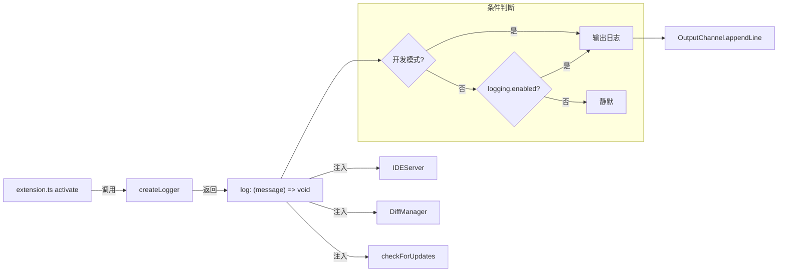

# logger.ts

> 创建条件化日志函数，仅在开发模式或用户启用调试日志时输出。

## 概述

`logger.ts` 是一个轻量的日志工具模块，提供唯一的工厂函数 `createLogger`。它返回一个闭包函数，该函数根据当前运行模式和用户配置决定是否将日志消息写入 VS Code OutputChannel。

**设计动机：** 扩展在生产环境中不应产生大量日志输出以避免性能开销和信息泄露。但在开发调试时，日志又是不可缺少的。本模块通过条件化输出实现了两者的平衡：
- **开发模式**（`ExtensionMode.Development`）-- 自动启用日志
- **生产模式** -- 用户可通过设置 `gemini-cli.debug.logging.enabled` 手动启用

该日志函数在 `extension.ts` 的 `activate` 中创建，并注入到 `IDEServer`、`DiffManager` 等模块中使用。

## 架构图



## 主要导出

### `createLogger`

```typescript
export function createLogger(
  context: vscode.ExtensionContext,
  logger: vscode.OutputChannel,
): (message: string) => void
```

**参数：**

| 参数 | 类型 | 说明 |
|------|------|------|
| `context` | `vscode.ExtensionContext` | 扩展上下文，用于判断运行模式 |
| `logger` | `vscode.OutputChannel` | VS Code 输出通道，日志实际写入的目标 |

**返回值：** `(message: string) => void` -- 日志打印闭包函数。

**行为：** 每次调用返回的函数时，会实时检查以下两个条件（非缓存，支持运行时动态切换）：

1. `context.extensionMode === vscode.ExtensionMode.Development` -- 是否为开发模式
2. `vscode.workspace.getConfiguration('gemini-cli.debug').get('logging.enabled')` -- 用户是否在设置中启用调试日志

任一条件为 `true` 时，调用 `logger.appendLine(message)` 输出日志；否则静默忽略。

## 核心逻辑

### 条件化日志输出

```typescript
return (message: string) => {
  const isDevMode = context.extensionMode === vscode.ExtensionMode.Development;
  const isLoggingEnabled = vscode.workspace
    .getConfiguration('gemini-cli.debug')
    .get('logging.enabled');

  if (isDevMode || isLoggingEnabled) {
    logger.appendLine(message);
  }
};
```

关键设计点：

1. **每次调用时重新检查配置** -- 不缓存 `isLoggingEnabled` 的值，这意味着用户可以在运行时通过修改 VS Code 设置动态开关日志，无需重启扩展。
2. **开发模式优先** -- 开发模式下无条件启用日志，无需手动配置。
3. **闭包封装** -- 通过闭包捕获 `context` 和 `logger`，调用方只需传入 message 字符串，简化了日志 API。

### VS Code 设置项

| 设置键 | 类型 | 默认值 | 说明 |
|--------|------|--------|------|
| `gemini-cli.debug.logging.enabled` | `boolean` | `false`（推测） | 是否在生产模式下启用调试日志 |

用户可在 VS Code 设置 UI 或 `settings.json` 中配置：

```json
{
  "gemini-cli.debug.logging.enabled": true
}
```

## 内部依赖

无。本模块不依赖同包其他模块。

## 外部依赖

| 包名 | 导入内容 | 用途 |
|------|---------|------|
| `vscode` | `ExtensionContext`, `OutputChannel`, `ExtensionMode`, `workspace` | 扩展运行模式判断、配置读取、日志输出通道 |
