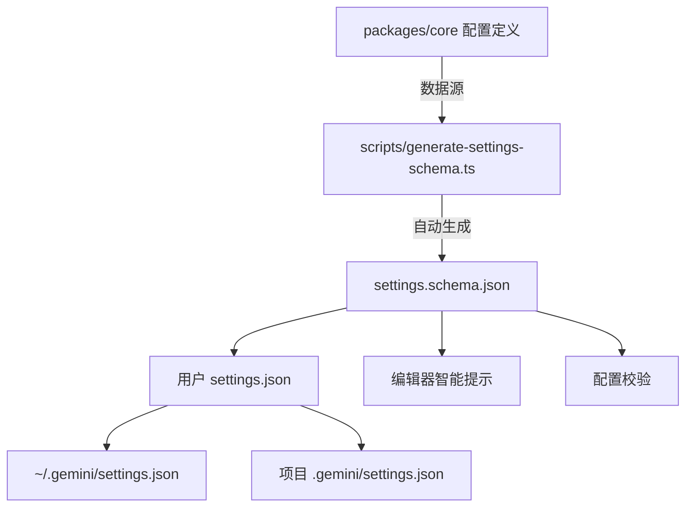

# schemas 架构

> Gemini CLI 配置文件的 JSON Schema 定义，为编辑器提供自动补全和校验支持。

## 概述

`schemas/` 目录包含 Gemini CLI 的 JSON Schema 定义文件。目前唯一的文件 `settings.schema.json` 为 `settings.json` 配置文件提供完整的 Schema 描述，使得用户在编辑器（如 VS Code）中编辑配置文件时能获得自动补全、类型校验和字段描述等智能提示。该 Schema 遵循 JSON Schema Draft 2020-12 标准，托管在 GitHub 上供远程引用。

## 架构图



## 目录结构

```
schemas/
└── settings.schema.json    # Gemini CLI 设置文件的 JSON Schema
```

## 关键文件

| 文件 | 功能 |
|------|------|
| `settings.schema.json` | Gemini CLI 配置的完整 JSON Schema，定义所有合法的设置项、类型、默认值和描述 |

### settings.schema.json 主要配置分类

| 配置分类 | 说明 |
|----------|------|
| `mcpServers` | MCP 服务器配置 |
| `policyPaths` / `adminPolicyPaths` | 策略文件路径 |
| `general` | 通用应用设置 |
| `theme` | 主题配置 |
| `tools` | 工具配置 |
| `agents` | 代理配置 |
| `experimental` | 实验性功能开关 |
| `codeExecution` | 代码执行设置 |
| `auth` | 认证配置 |

## 内部依赖

- 由 `scripts/generate-settings-schema.ts` 根据 `packages/core` 中的配置定义自动生成
- 被用户的 `settings.json` 通过 `$schema` 字段引用

## 外部依赖

| 标准/规范 | 用途 |
|-----------|------|
| JSON Schema Draft 2020-12 | Schema 规范标准 |
| GitHub Raw 文件托管 | 远程 Schema URL 引用 (`https://raw.githubusercontent.com/google-gemini/gemini-cli/main/schemas/settings.schema.json`) |
