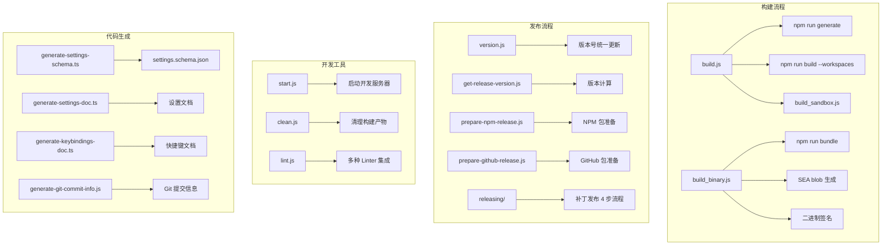

# scripts 架构

> Gemini CLI 的构建、发布、测试和开发工具脚本集合。

## 概述

`scripts/` 目录包含 Gemini CLI 项目的全部自动化脚本，覆盖从本地开发（构建、启动、清理）到 CI/CD（版本管理、发布准备、遥测分析）再到代码质量（lint、格式化）的完整工作流。脚本以 JavaScript/TypeScript 编写，部分使用 Shell 脚本。子目录 `releasing/` 包含补丁发布流程脚本，`tests/` 包含脚本自身的测试，`utils/` 包含共享工具函数。

## 架构图



## 目录结构

```
scripts/
├── build.js                      # 主构建脚本（install + generate + build）
├── build_binary.js               # SEA 二进制构建脚本
├── build_package.js              # 单个包构建（tsc + copy files）
├── build_sandbox.js              # 沙箱容器镜像构建
├── build_vscode_companion.js     # VS Code 伴侣扩展构建
├── start.js                      # 开发模式启动脚本
├── clean.js                      # 清理所有构建产物
├── version.js                    # 版本号统一更新
├── get-release-version.js        # 发布版本计算（nightly/preview/stable/patch）
├── prepare-npm-release.js        # NPM 发布准备
├── prepare-github-release.js     # GitHub 发布准备
├── prepare-package.js            # 通用包准备
├── lint.js                       # 集成 Linter（ESLint/actionlint/shellcheck/yamllint/prettier）
├── pre-commit.js                 # Git pre-commit 钩子
├── check-build-status.js         # 构建状态检查
├── check-lockfile.js             # lockfile 一致性检查
├── copy_files.js                 # 文件复制工具
├── copy_bundle_assets.js         # Bundle 资产复制
├── sandbox_command.js            # 沙箱命令工具
│
├── generate-settings-schema.ts   # settings.schema.json 生成
├── generate-settings-doc.ts      # 设置文档生成
├── generate-keybindings-doc.ts   # 快捷键文档生成
├── generate-git-commit-info.js   # Git 提交信息生成
│
├── aggregate_evals.js            # 评估结果聚合分析
├── deflake.js                    # 测试去抖动工具
├── changed_prompt.js             # 提示词变更检测
│
├── telemetry.js                  # 遥测数据分析
├── telemetry_gcp.js              # GCP 遥测数据处理
├── telemetry_genkit.js           # Genkit 遥测数据处理
├── telemetry_utils.js            # 遥测工具函数
├── local_telemetry.js            # 本地遥测分析
│
├── cleanup-branches.ts           # Git 分支清理
├── close_duplicate_issues.js     # 关闭重复 Issue
├── sync_project_dry_run.js       # 项目同步预演
├── test-windows-paths.js         # Windows 路径测试
│
├── batch_triage.sh               # 批量 Issue 分流
├── create_alias.sh               # 创建命令别名
├── relabel_issues.sh             # Issue 重新标记
├── review.sh                     # 代码审查辅助
├── send_gemini_request.sh        # Gemini API 请求发送
│
├── releasing/                    # 补丁发布脚本（4 步流程）
├── tests/                        # 脚本测试
└── utils/                        # 共享工具函数
```

## 关键文件

| 文件 | 功能 |
|------|------|
| `build.js` | 主构建脚本：install -> generate -> build 所有 workspace -> 可选 sandbox 构建 |
| `build_binary.js` | SEA 二进制完整构建：clean -> bundle -> 原生模块暂存 -> SEA 配置生成 -> blob 注入 -> 签名 |
| `start.js` | 开发模式启动：检查构建状态、配置调试选项、spawn CLI 进程 |
| `clean.js` | 递归清理：node_modules、bundle、所有 workspace 的 dist、生成文件 |
| `version.js` | 原子版本更新：同步更新 root + 所有 workspace 的 package.json 和 sandboxImageUri |
| `get-release-version.js` | 版本计算引擎：支持 nightly/preview/stable/patch 四种类型，处理回滚检测和冲突递增 |
| `lint.js` | 统一 Lint 入口：自动安装 actionlint/shellcheck/yamllint，集成 ESLint/Prettier/敏感词/TSConfig 检查 |
| `prepare-npm-release.js` | NPM 发布准备：复制 bundle、清理依赖、设置 optionalDependencies |
| `prepare-github-release.js` | GitHub 发布准备：修改包名为 @google-gemini scope、配置 GitHub NPM registry |

## 内部依赖

| 模块 | 用途 |
|------|------|
| `@google/gemini-cli-core` | 提供 `GEMINI_DIR` 等常量 |
| `packages/core` 配置定义 | 作为 schema/文档生成的数据源 |
| `sea/sea-launch.cjs` | build_binary.js 中引用的 SEA 入口 |

## 外部依赖

| 包名 | 用途 |
|------|------|
| `semver` | 语义化版本解析和比较 |
| `yargs` | 命令行参数解析 |
| `prettier` | 代码格式化 |
| `glob` | 文件模式匹配 |
| `@octokit/rest` | GitHub API 客户端 |
