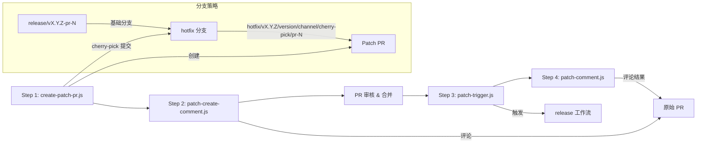

# scripts/releasing 架构

> 补丁发布（Patch Release）的 4 步自动化流程脚本。

## 概述

`scripts/releasing/` 目录包含 Gemini CLI 补丁发布流程的核心脚本。补丁发布是一个 4 步流水线：Step 1 创建 cherry-pick PR，Step 2 在原始 PR 上评论通知，Step 3 在 PR 合并后触发发布工作流，Step 4 评论发布结果。这些脚本与 GitHub Actions 工作流紧密集成，通过 `gh` CLI 工具与 GitHub API 交互，支持 stable 和 preview 两个发布通道，并内置冲突检测和 dry-run 模式。

## 架构图



## 目录结构

```
scripts/releasing/
├── create-patch-pr.js       # Step 1: 创建补丁 PR（cherry-pick + push + gh pr create）
├── patch-create-comment.js  # Step 2: 解析 Step 1 结果并评论到原始 PR
├── patch-trigger.js         # Step 3: 检测通道并触发发布工作流
└── patch-comment.js         # Step 4: 评论发布结果（成功/失败/竞态条件）
```

## 关键文件

| 文件 | 功能 |
|------|------|
| `create-patch-pr.js` | 补丁 PR 创建：fetch tags -> 确定 release 分支 -> cherry-pick 提交 -> 检测冲突 -> push -> 创建 PR。支持 `--commit`、`--channel`（stable/preview）、`--dry-run` 参数 |
| `patch-create-comment.js` | 创建评论：解析 Step 1 的日志输出，智能识别成功/冲突/权限问题/已存在 PR/已存在分支等场景，生成对应的 Markdown 评论。支持 `--test` 模式和环境变量 `LOG_CONTENT` |
| `patch-trigger.js` | 发布触发：从 hotfix 分支名解析通道信息（`getBranchInfo`），通过 `gh workflow run` 触发 `release-patch-3-release.yml`，评论进度到原始 PR。支持多种分支命名格式 |
| `patch-comment.js` | 结果评论：根据发布状态生成成功/失败/竞态条件取消三种评论，通过 `@octokit/rest` API 发送。支持 `--test` 模式 |

### 分支命名规则

| 分支类型 | 格式 | 示例 |
|----------|------|------|
| release 分支 | `release/{tag}-pr-{N}` | `release/v0.5.3-pr-1234` |
| hotfix 分支（新格式） | `hotfix/{base}/{next}/{channel}/cherry-pick-{sha}/pr-{N}` | `hotfix/v0.5.3/v0.5.4/preview/cherry-pick-abc1234/pr-1234` |

## 内部依赖

| 模块 | 用途 |
|------|------|
| `scripts/get-release-version.js` | `create-patch-pr.js` 调用以计算下一个补丁版本号 |

## 外部依赖

| 包名 | 用途 |
|------|------|
| `yargs` | 命令行参数解析 |
| `@octokit/rest` | GitHub API 客户端（`patch-comment.js` 使用） |
| `gh` CLI | GitHub CLI 工具（PR 创建、工作流触发、评论发送） |
| `git` | Git 操作（fetch、checkout、cherry-pick、push） |
