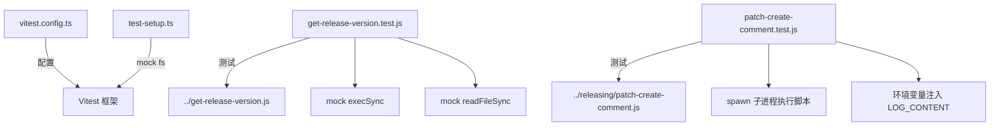

# scripts/tests 架构

> scripts/ 目录中关键脚本的单元测试集。

## 概述

`scripts/tests/` 目录包含对 `scripts/` 下核心脚本的单元测试，确保版本计算、补丁评论生成等关键发布逻辑的正确性。测试使用 Vitest 框架，通过 mock 机制隔离外部依赖（如 npm CLI、git CLI、GitHub API），验证各种正常和异常场景。

## 架构图



## 目录结构

```
scripts/tests/
├── vitest.config.ts                 # Vitest 配置
├── test-setup.ts                    # 测试全局设置（mock fs）
├── get-release-version.test.js      # 版本计算逻辑测试
└── patch-create-comment.test.js     # 补丁创建评论逻辑测试
```

## 关键文件

| 文件 | 功能 |
|------|------|
| `vitest.config.ts` | 测试配置：node 环境、8-16 线程并行、V8 代码覆盖率（text + lcov）、匹配 `scripts/tests/**/*.test.{js,ts}` |
| `test-setup.ts` | 全局 mock 设置：mock `fs.appendFileSync` 以避免测试中的文件写入副作用 |
| `get-release-version.test.js` | 版本计算测试：覆盖 stable/preview/nightly/patch 四种版本类型、废弃版本跳过、版本冲突自动递增等场景。通过 mock `execSync` 模拟 npm/git 命令输出 |
| `patch-create-comment.test.js` | 补丁评论测试：覆盖成功/失败/冲突/已存在 PR/权限问题/空日志等场景。通过实际 spawn 子进程执行脚本并验证 stdout 输出 |

### get-release-version.test.js 测试矩阵

| 测试分类 | 覆盖场景 |
|----------|----------|
| 快乐路径 | stable 版本计算、preview 版本计算、nightly 版本计算、stable patch 版本、preview patch 版本 |
| 高级场景 | 废弃版本忽略、版本冲突自动递增（stable 和 preview） |

### patch-create-comment.test.js 测试矩阵

| 测试分类 | 覆盖场景 |
|----------|----------|
| 环境标志 | 命令行覆盖、环境变量读取、无效值拒绝、默认值 |
| 日志解析 | 成功 cherry-pick、冲突检测、已存在 PR、无 PR 分支、失败回退 |
| 通道检测 | stable -> latest、preview -> preview |
| 边界情况 | 无原始 PR、空日志、权限问题 |

## 内部依赖

| 模块 | 用途 |
|------|------|
| `scripts/get-release-version.js` | 被测试的版本计算逻辑 (`getVersion` 函数) |
| `scripts/releasing/patch-create-comment.js` | 被测试的评论生成脚本 |

## 外部依赖

| 包名 | 用途 |
|------|------|
| `vitest` | 测试框架（`vi.mock`、`vi.mocked`、`vi.stubEnv` 等） |
| `node:child_process` | `execSync` 被 mock 或用于 spawn 子进程 |
| `node:fs` | `readFileSync` 被 mock |
