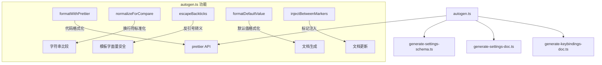

# scripts/utils 架构

> 脚本共享的工具函数集，提供代码格式化和文档自动生成辅助功能。

## 概述

`scripts/utils/` 目录包含被 `scripts/` 下多个代码生成脚本共享的工具函数。核心模块 `autogen.ts` 提供 Prettier 格式化集成、内容标记注入、默认值格式化等功能，主要服务于 settings schema 生成、settings 文档生成和 keybindings 文档生成等自动化流程。

## 架构图



## 目录结构

```
scripts/utils/
└── autogen.ts    # 代码生成共享工具函数
```

## 关键文件

| 文件 | 功能 |
|------|------|
| `autogen.ts` | 代码生成工具模块，导出 5 个核心函数 |

### 导出函数详解

| 函数 | 签名 | 功能 |
|------|------|------|
| `formatWithPrettier` | `(content: string, filePath: string) => Promise<string>` | 使用 Prettier 格式化内容，自动解析配置文件 |
| `normalizeForCompare` | `(content: string) => string` | 标准化换行符（CRLF -> LF）并去除尾部空白，用于内容比较 |
| `escapeBackticks` | `(value: string) => string` | 转义反斜杠和反引号，确保在模板字面量中安全使用 |
| `formatDefaultValue` | `(value: unknown, options?) => string` | 将任意类型的默认值格式化为可读字符串，支持 `quoteStrings` 选项 |
| `injectBetweenMarkers` | `(options: MarkerInsertionOptions) => string` | 在文档的起止标记之间替换内容，保留标记外的原始内容 |

### 类型定义

| 接口 | 字段 | 说明 |
|------|------|------|
| `FormatDefaultValueOptions` | `quoteStrings?: boolean` | 控制字符串值是否包含 JSON 引号 |
| `MarkerInsertionOptions` | `document, startMarker, endMarker, newContent, paddingBefore?, paddingAfter?` | 标记注入的完整参数 |

## 内部依赖

被以下脚本引用：
- `scripts/generate-settings-schema.ts` - 生成 `schemas/settings.schema.json`
- `scripts/generate-settings-doc.ts` - 生成设置文档
- `scripts/generate-keybindings-doc.ts` - 生成快捷键文档

## 外部依赖

| 包名 | 用途 |
|------|------|
| `prettier` | 代码格式化引擎，通过 `resolveConfig` 和 `format` API 使用 |
