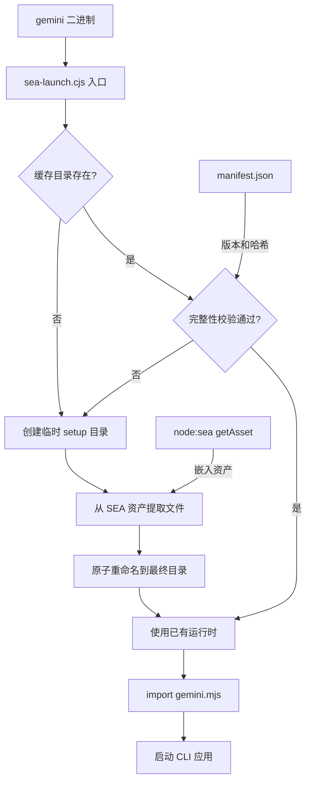

# sea 架构

> Node.js 单可执行应用（Single Executable Application）的启动器，将 Gemini CLI 打包为独立二进制文件。

## 概述

`sea/` 目录包含 Gemini CLI 的 SEA（Single Executable Application）启动逻辑。Node.js SEA 技术允许将整个应用打包到一个独立的二进制文件中，无需用户安装 Node.js 运行时。`sea-launch.cjs` 是 SEA 二进制的入口点，负责从嵌入的资产中提取运行时文件到临时目录，进行完整性校验（SHA-256 哈希），然后动态 import 主应用模块。该机制确保了安全性（目录权限和所有权检查）和原子性（通过临时目录+重命名实现无竞态部署）。

## 架构图



## 目录结构

```
sea/
├── sea-launch.cjs        # SEA 启动器主逻辑（CommonJS 格式）
└── sea-launch.test.js    # 启动器单元测试
```

## 关键文件

| 文件 | 功能 |
|------|------|
| `sea-launch.cjs` | SEA 入口点，包含 5 个核心函数和主执行流程 |
| `sea-launch.test.js` | 全面的单元测试，覆盖各种边界条件 |

### sea-launch.cjs 核心函数

| 函数 | 功能 |
|------|------|
| `sanitizeArgv()` | 清理 Node SEA 注入的幽灵参数（argv[2] == argv[0]） |
| `getSafeName()` | 将字符串清理为安全的文件路径名 |
| `verifyIntegrity()` | 通过 SHA-256 哈希校验运行时目录与清单文件的一致性 |
| `prepareRuntime()` | 核心函数：准备运行时目录（检查缓存/安全性/提取资产/原子部署） |
| `main()` | 入口函数：设置环境变量、解析清单、准备运行时、启动应用 |

### 安全机制

- 目录权限校验：确保运行时目录为 `0o700`（仅所有者可读写执行）
- 所有权校验：确保目录的 uid 与当前进程一致
- SHA-256 完整性校验：每个文件与 manifest.json 中的哈希比对
- 原子部署：先在临时目录写入，再 rename 到最终路径，避免竞态条件
- Windows 兼容：在 Windows 上使用 `LOCALAPPDATA` 路径，跳过严格权限检查

## 内部依赖

- 由 `scripts/build_binary.js` 在构建时生成 SEA 配置和 manifest
- 运行时加载 `bundle/gemini.mjs` 主应用模块

## 外部依赖

| 模块 | 用途 |
|------|------|
| `node:sea` | Node.js SEA API（`getAsset` 函数） |
| `node:crypto` | SHA-256 哈希计算 |
| `node:fs` | 文件系统操作 |
| `node:os` | 获取临时目录和用户信息 |
| `node:module` | 启用编译缓存 (`enableCompileCache`) |
| `node:url` | 文件路径转 URL（`pathToFileURL`） |
