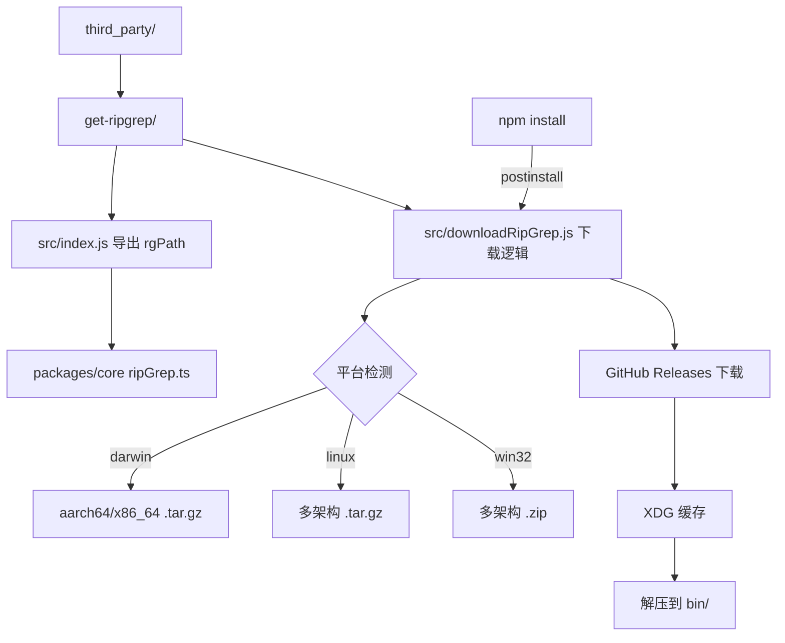

# third_party 架构

> 第三方工具集成模块，管理项目所需的外部二进制依赖。

## 概述

`third_party/` 目录包含 Gemini CLI 项目对第三方工具的集成封装。目前唯一的子模块是 `get-ripgrep`，负责自动下载和管理 ripgrep 二进制文件。ripgrep 是 Gemini CLI 的核心搜索后端，用于在代码库中执行高性能的文本搜索（Grep 工具）。该目录采用独立包结构，通过 postinstall 脚本自动在 `npm install` 时下载平台对应的 ripgrep 二进制。

## 架构图



## 目录结构

```
third_party/
└── get-ripgrep/              # ripgrep 二进制获取包
    ├── package.json          # 包配置（postinstall 触发下载）
    ├── src/
    │   ├── index.js          # 导出 rgPath（ripgrep 二进制路径）
    │   └── downloadRipGrep.js # 下载和解压逻辑
    └── bin/                  # ripgrep 二进制存放目录（动态生成）
```

## 关键文件

| 文件 | 功能 |
|------|------|
| `get-ripgrep/package.json` | 包名 `@lvce-editor/ripgrep`，定义 postinstall 脚本和依赖 |
| `get-ripgrep/src/index.js` | 导出 `rgPath` 变量，指向 `../bin/rg`（Windows 为 `../bin/rg.exe`） |
| `get-ripgrep/src/downloadRipGrep.js` | ripgrep 下载核心逻辑 |

## 内部依赖

| 模块 | 用途 |
|------|------|
| `packages/core/src/tools/ripGrep.ts` | 消费 `rgPath`，在 CLI 工具中使用 ripgrep |
| `integration-tests/globalSetup.ts` | 在集成测试初始化时调用 `canUseRipgrep()` 确保可用 |

## 外部依赖

| 包名 | 用途 |
|------|------|
| `got` | HTTP 客户端，下载 ripgrep 发行包 |
| `extract-zip` | ZIP 文件解压（Windows 平台） |
| `execa` | 执行 `tar` 命令解压 .tar.gz |
| `fs-extra` | 增强文件操作（mkdir、createWriteStream、move） |
| `tempy` | 创建临时文件路径 |
| `path-exists` | 检查缓存文件是否存在 |
| `xdg-basedir` | XDG 缓存目录路径 |
| `@lvce-editor/verror` | 增强错误报告 |
