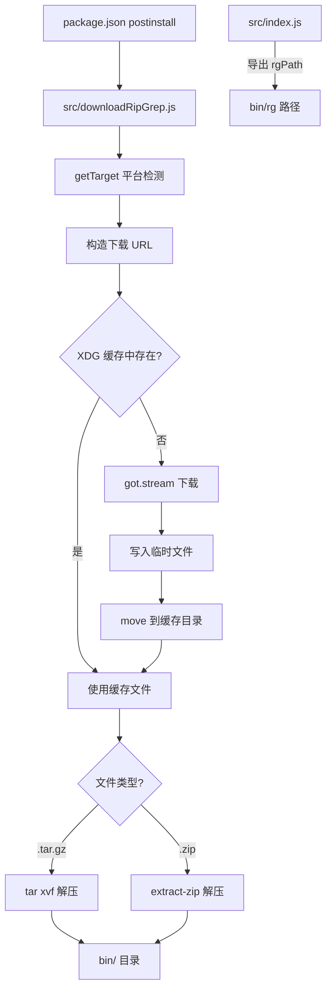

# third_party/get-ripgrep 架构

> ripgrep 二进制文件的自动下载和管理包，为 Gemini CLI 提供高性能文本搜索能力。

## 概述

`get-ripgrep/` 是一个独立的 npm 包（`@lvce-editor/ripgrep`），源自 lvce-editor 项目，负责在 `npm install` 时通过 postinstall 脚本自动下载与当前平台匹配的 ripgrep 预编译二进制文件。下载的文件来自 `microsoft/ripgrep-prebuilt` GitHub 发行版，支持 macOS（Intel/ARM）、Linux（x64/ARM/ARM64/PPC64/S390x）和 Windows（x64/ARM/x86）多个平台架构组合。下载的文件会缓存到 XDG 缓存目录以避免重复下载。

## 架构图



## 目录结构

```
get-ripgrep/
├── package.json              # 包配置（@lvce-editor/ripgrep）
├── src/
│   ├── index.js              # 导出 rgPath
│   ├── index.d.ts            # TypeScript 类型声明
│   └── downloadRipGrep.js    # 下载和解压逻辑
└── bin/                      # ripgrep 二进制（npm install 后生成）
    └── rg                    # ripgrep 可执行文件（或 rg.exe）
```

## 关键文件

| 文件 | 功能 |
|------|------|
| `package.json` | 包配置：`postinstall` 触发 `src/postinstall.js`，声明 `got`/`extract-zip`/`execa`/`fs-extra`/`tempy`/`path-exists`/`xdg-basedir` 依赖 |
| `src/index.js` | 简单的路径导出模块，计算 `rgPath = __dirname/../bin/rg`（Windows 为 `.exe` 后缀） |
| `src/downloadRipGrep.js` | 核心下载逻辑，包含平台检测、缓存管理、下载、解压等完整流程 |

### 支持的平台架构映射

| 平台 | 架构 | 下载目标 |
|------|------|----------|
| darwin | arm64 | `aarch64-apple-darwin.tar.gz` |
| darwin | x64 (default) | `x86_64-apple-darwin.tar.gz` |
| win32 | x64 | `x86_64-pc-windows-msvc.zip` |
| win32 | arm | `aarch64-pc-windows-msvc.zip` |
| win32 | default | `i686-pc-windows-msvc.zip` |
| linux | x64 | `x86_64-unknown-linux-musl.tar.gz` |
| linux | arm/armv7l | `arm-unknown-linux-gnueabihf.tar.gz` |
| linux | arm64 | `aarch64-unknown-linux-gnu.tar.gz` |
| linux | ppc64 | `powerpc64le-unknown-linux-gnu.tar.gz` |
| linux | s390x | `s390x-unknown-linux-gnu.tar.gz` |
| linux | default | `i686-unknown-linux-musl.tar.gz` |

### 下载源

- 仓库：`microsoft/ripgrep-prebuilt`
- 版本：`v13.0.0-10`（可通过 `RIPGREP_VERSION` 环境变量覆盖）
- URL 格式：`https://github.com/microsoft/ripgrep-prebuilt/releases/download/{VERSION}/ripgrep-{VERSION}-{TARGET}`
- 缓存路径：`{XDG_CACHE_HOME}/vscode-ripgrep/ripgrep-{VERSION}-{TARGET}`

## 内部依赖

- 被 `packages/core/src/tools/ripGrep.ts` 通过 `rgPath` 引用使用

## 外部依赖

| 包名 | 用途 |
|------|------|
| `got` | HTTP 流式下载客户端 |
| `extract-zip` | ZIP 文件解压（Windows 平台使用） |
| `execa` | 子进程执行 `tar` 解压命令 |
| `fs-extra` | 增强文件操作（`mkdir`、`createWriteStream`、`move`） |
| `tempy` | 创建安全的临时文件路径 |
| `path-exists` | 缓存文件存在性检查 |
| `xdg-basedir` | XDG 标准缓存目录获取 |
| `@lvce-editor/verror` | 增强的错误链追踪 |
