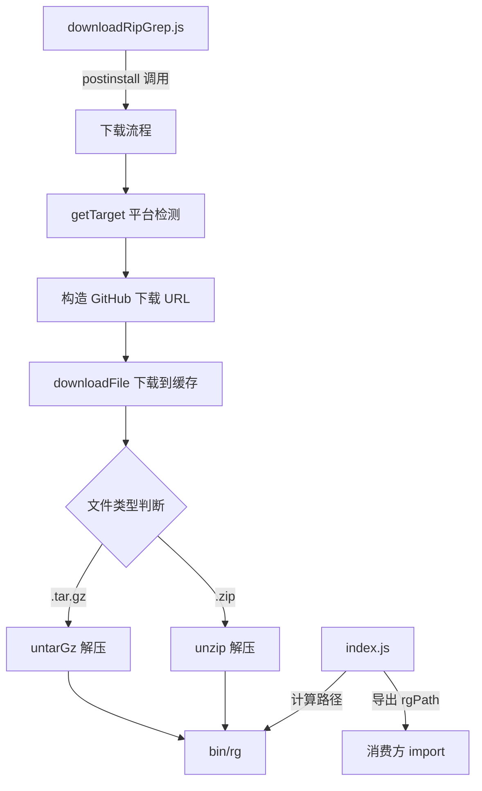

# third_party/get-ripgrep/src 架构

> ripgrep 包的源代码目录，包含路径导出和下载逻辑两个模块。

## 概述

`src/` 目录包含 `@lvce-editor/ripgrep` 包的全部源代码。该目录仅有两个模块：`index.js` 负责导出 ripgrep 二进制的本地路径，`downloadRipGrep.js` 负责从 GitHub 下载预编译的 ripgrep 二进制并解压到本地 `bin/` 目录。两个模块职责明确分离：`index.js` 是运行时引用的入口，`downloadRipGrep.js` 仅在安装时（postinstall）执行。

## 架构图



## 目录结构

```
src/
├── index.js              # rgPath 导出
├── index.d.ts            # TypeScript 类型声明
└── downloadRipGrep.js    # 下载和解压逻辑
```

## 关键文件

| 文件 | 功能 |
|------|------|
| `index.js` | 导出 `rgPath` 常量：`path.join(__dirname, '..', 'bin', 'rg')` + 平台后缀 |
| `downloadRipGrep.js` | 完整的下载流程实现，包含 5 个核心函数 |

### index.js

一个极简的模块，仅包含路径计算逻辑：

```javascript
export const rgPath = join(__dirname, '..', 'bin', `rg${process.platform === 'win32' ? '.exe' : ''}`)
```

### downloadRipGrep.js 核心函数

| 函数 | 参数 | 功能 |
|------|------|------|
| `getTarget()` | 无 | 根据 `process.platform` 和 `process.arch`（或 `npm_config_arch`）返回下载目标平台字符串 |
| `downloadFile(url, outFile)` | URL 和输出路径 | 使用 `got.stream` 流式下载到临时文件，然后 `move` 到目标路径 |
| `unzip(inFile, outDir)` | 输入文件和输出目录 | 使用 `extract-zip` 解压 ZIP 文件（Windows 平台） |
| `untarGz(inFile, outDir)` | 输入文件和输出目录 | 使用 `execa('tar', ['xvf', ...])` 解压 tar.gz 文件 |
| `downloadRipGrep(binPath?)` | 可选的输出目录 | 主流程编排：检查缓存 -> 下载 -> 根据后缀选择解压方式 |

### 缓存机制

- 缓存目录：`{xdgCache}/vscode-ripgrep/`（通过 `xdg-basedir` 获取）
- 缓存键：`ripgrep-{VERSION}-{TARGET}`（包含版本号和平台标识）
- 命中策略：如果缓存文件已存在则跳过下载，直接进入解压步骤
- 错误处理：所有操作都通过 `VError` 包装异常，提供完整的错误链追踪

## 内部依赖

- `index.js` 不依赖 `downloadRipGrep.js`，两者独立运作
- `downloadRipGrep.js` 由包的 `postinstall` 脚本间接调用

## 外部依赖

| 包名 | 文件 | 用途 |
|------|------|------|
| `node:path` | `index.js` | 路径拼接 |
| `node:url` | `index.js` | `fileURLToPath` 转换 |
| `got` | `downloadRipGrep.js` | HTTP 流式下载 |
| `extract-zip` | `downloadRipGrep.js` | ZIP 解压 |
| `execa` | `downloadRipGrep.js` | 执行 `tar` 命令 |
| `fs-extra` | `downloadRipGrep.js` | `mkdir`、`createWriteStream`、`move` |
| `tempy` | `downloadRipGrep.js` | 临时文件路径 |
| `path-exists` | `downloadRipGrep.js` | 缓存存在性检查 |
| `xdg-basedir` | `downloadRipGrep.js` | XDG 缓存目录 |
| `@lvce-editor/verror` | `downloadRipGrep.js` | 错误链包装 |
| `node:os` | `downloadRipGrep.js` | 平台和架构检测 |
| `node:stream/promises` | `downloadRipGrep.js` | `pipeline` 流式处理 |
